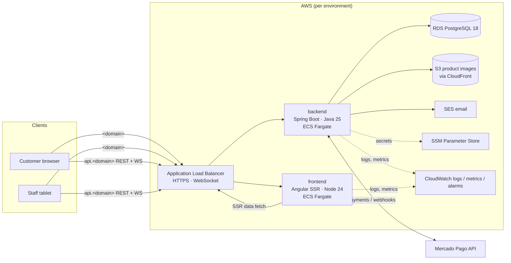
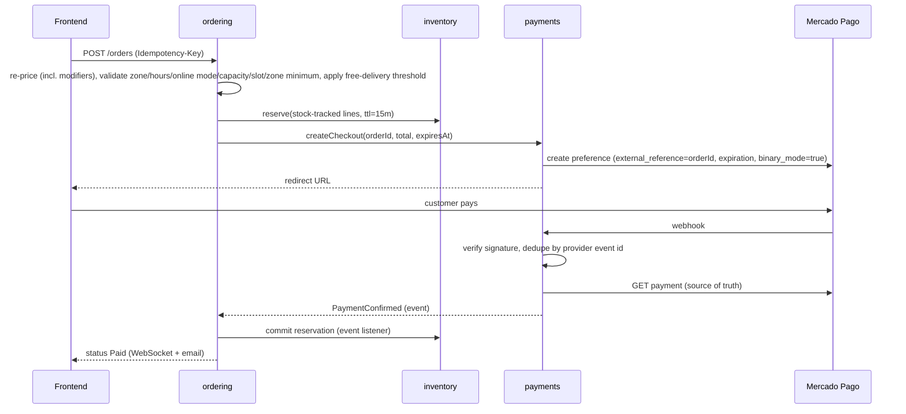

# Tech Spec — Juice Bar Omnichannel Platform (Release 1)

| Field | Value |
|-------|-------|
| Status | Draft v2 |
| Owner | Jhan Antezana |
| Last updated | 2026-09-17 |
| Implements | [PRD.md](./PRD.md) |

This document defines **how** the PRD is built: architecture, data, APIs, security, infrastructure, and delivery. Requirement IDs (`FR-*`, `NFR-*`, `BR-*`) refer to the PRD.

## 1. Decisions at a glance

| Area | Decision |
|------|----------|
| Architecture | **Modular monolith** — one Spring Boot deployable, modules enforced by Spring Modulith, one PostgreSQL schema per module |
| Backend | Java 25 (LTS) · Spring Boot 4.1.x · Spring Modulith 2.1.x · Spring Security 7 · JPA + Flyway |
| Frontend | Angular **22** · zoneless · signals · hybrid SSR |
| Database | PostgreSQL 18 on Amazon RDS, one instance per environment |
| Real-time | STOMP over WebSocket; cross-instance fan-out with PostgreSQL `LISTEN/NOTIFY` |
| Payments | `PaymentGateway` port; **Mercado Pago Checkout Pro** in binary mode as first adapter |
| Preparation board | Projection owned by `preparation`; its row state arbitrates staff/customer races |
| Hosting | AWS **ECS Express Mode** (Fargate + ALB) · RDS · S3 · ECR · SES · SSM Parameter Store |
| IaC | Terraform (foundation resources); services deployed by the pipeline |
| Environments | `test` and `prod` |
| Branching | `feature/*` → `develop` (auto-deploys `test`) → release PR → `main` (deploys `prod` after approval); `hotfix/*` → `main`, then back-merge to `develop`; build once, promote the same image |
| CI/CD | GitHub Actions, OIDC to AWS, reusable workflows, manual approval for `prod` |

Rejected alternatives and reasons are in §13.

## 2. Architecture overview



| Hostname | Target |
|----------|--------|
| `<domain>` / `test.<domain>` | frontend service |
| `api.<domain>` / `api.test.<domain>` | backend service (REST `/api/v1/**`, WebSocket `/ws`, webhooks `/api/v1/payments/webhooks/**`) |

`<domain>` is **`jugueria.jhanantezana.com`** (PRD Q4): a subdomain, so the parent domain stays free for other uses. Frontend and API are on different hosts of the **same site** (`jhanantezana.com`), so the refresh cookie works with `SameSite=Strict` and CORS allows only the matching frontend origin.

## 3. Technology stack and versions

| Layer | Choice | Version policy |
|-------|--------|----------------|
| Runtime | Java 25 (Eclipse Temurin) | LTS; virtual threads enabled (`spring.threads.virtual.enabled=true`) |
| Framework | Spring Boot 4.1.x (already in `pom.xml`) | Follow patch releases via Dependabot |
| Modularity | `spring-modulith-starter-core`, `-starter-jdbc`, `-starter-test` 2.1.x | Version from `spring-modulith-bom` |
| Persistence | Spring Data JPA (Hibernate 7) · `spring-boot-starter-flyway` · PostgreSQL driver | — |
| API docs | springdoc-openapi 3.x (Boot 4 line) | — |
| Cache | `spring-boot-starter-cache` + Caffeine | In-process only |
| HTTP client | `RestClient` / HTTP interface clients | Timeouts mandatory |
| Resilience | Spring Framework 7 `@Retryable` / `@ConcurrencyLimit` (`@EnableResilientMethods`) | No extra library |
| Rate limiting | Bucket4j (in-memory, per task) | Coarse throttling of auth and checkout endpoints only; per-task counts are an accepted approximation. Security-relevant counters (lockout, idempotency) live in PostgreSQL |
| Observability | Actuator · Micrometer · `micrometer-registry-cloudwatch2` · structured JSON logs | — |
| Frontend | Angular 22 · TypeScript (per Angular 22 support matrix) · Node 24 LTS (`.nvmrc`; Angular 22 supports `^24.15.0`) | Follow new majors with `ng update`, one major at a time |
| Frontend tests | Vitest (Angular default since v21) · Playwright for E2E | — |
| Local dev | Docker Compose (`compose.yaml`) + `spring-boot-docker-compose` | — |

**Dependency policy** (applies to backend, frontend, and CI actions):

- **A new dependency requires the owner's explicit approval.** The proposal states the problem, why the platform (JDK, Spring Boot starters, Angular packages, Web APIs) is not enough, the alternatives considered, license, maintenance activity, and — for the frontend — bundle size impact.
- Prefer the platform: `Intl` for formatting, `crypto.randomUUID()` for idempotency keys, `java.time` for dates, Spring's `RestClient` for HTTP.
- Backend versions come from BOMs (Spring Boot parent, `spring-modulith-bom`). Unmanaged libraries declare their version once in `<properties>`. No version ranges, `SNAPSHOT`, or milestone versions on `develop`/`main`.
- A BOM-managed version may be **overridden in `<properties>` only to take a security patch** the current BOM does not carry yet, and only while no GA release of that BOM line fixes it (a milestone does not count). Each override names the vulnerability it closes in a comment and is removed once the BOM catches up. In force: `tomcat.version` 11.0.26, because Spring Boot 4.1.1 pins 11.0.24 and that release carries an authentication bypass.
- Frontend: `package-lock.json` is committed and CI installs with `npm ci`, never `npm install`.
- Licenses: **direct dependencies** MIT, Apache-2.0, BSD, or ISC (checked at approval). **Transitive dependencies** may also use other permissive licenses common in the npm ecosystem: 0BSD, BlueOak-1.0.0, CC0-1.0, Unlicense, Python-2.0, CC-BY-4.0 (data files). `actions/dependency-review-action` enforces the union of both lists (`allow-licenses`), since it cannot tell direct from transitive. GPL/AGPL are rejected.
- **No license exceptions are in force.** PrimeNG 22+ (PrimeUI license) would need one, recorded here with its conditions, before it is adopted (§6.7).
- Updates arrive through Dependabot, one major version at a time. PrimeNG majors are ignored (§6.7).
- Already rejected — do not propose again without new arguments: jjwt (§7.1), MapStruct (§4.13), H2 (§11.1), Redis or any broker client (§13 D4/D5), NgRx or any global store (§6.2), runtime OpenAPI client generators (§6.5), `uuid`/`lodash`/`moment` (platform APIs cover them).


`spring-boot-devtools` stays `optional`/`runtime` and is excluded from the production image (the Spring Boot Maven plugin already excludes it from repackaged jars).

**Scaffold changes at M0** (the current scaffold does not have them yet):

| Where | Change |
|-------|--------|
| `backend/pom.xml` | Add `spring-modulith-bom` (import) and `spring-modulith-starter-core`, `-starter-jdbc`, `-starter-test`; `spring-boot-starter-flyway`, `-actuator`, `-validation`, `-cache` + `caffeine`; `spring-boot-starter-security-oauth2-resource-server` (§7.1; Boot 4 name — the old `spring-boot-starter-oauth2-resource-server` is deprecated); `com.fasterxml.uuid:java-uuid-generator` (UUID v7, §4.11); ArchUnit (test, §7.1 and §4.12 rules); `maven-failsafe-plugin` bound to `verify` for `*IT` tests (§11.1); AWS SDK for Java v2 `s3` and `sesv2`, plus `sso`/`ssooidc` for local SSO profiles (§8.5), added with the first WP that needs them; `springdoc-openapi-starter-webmvc-ui`; `bucket4j-core`; `spring-boot-docker-compose` (dev only); Testcontainers PostgreSQL and WireMock (test) |
| `application.properties` | Remove `spring.profiles.active=dev`. No profile is hardcoded: `SPRING_PROFILES_ACTIVE` is `test` or `prod` in each ECS service, and `local` for development |
| `frontend/` | Remove leftover Karma/Jasmine packages (Angular 22 and Vitest are already in place); replace `RenderMode.Prerender` on `**` (§6.1); `withEventReplay()` → `withIncrementalHydration()`; add angular-eslint |

## 4. Backend design

### 4.1 Modules

Base package: `com.jhanantezana.jugueria`. Each direct sub-package is a Spring Modulith application module.

| Module | Owns | Publishes events | PRD |
|--------|------|------------------|-----|
| `identity` | Users, roles, credentials, refresh tokens, email verification | `UserCreated`, `UserDeactivated`, `UserRoleChanged` | FR-ONL-01, FR-ADM-01 |
| `store` | Store settings: hours, timezone, currency, zones (fee, delivery minutes, minimum, free threshold), online mode (open / busy / paused), estimate parameters, thresholds, reason lists | `StoreSettingsChanged`, `OnlineModeChanged` | FR-ADM-02, FR-ONL-08/12/18, FR-INS-14 |
| `catalog` | Categories, stations, products, modifier groups/options, allergens, prices, availability, images | `ProductChanged`, `AvailabilityChanged` | FR-CAT-* |
| `inventory` | Stock levels, reservations, stock movement ledger, returns | `StockAdjusted`, `StockDepleted`, `StockLow` | FR-STK-*, BR-10 |
| `ordering` | Online orders, lines (price snapshots), estimates, run-out preference, scheduling slots, status history, delivery failure/retry, cancellations | `OrderPlaced`, `OrderPaid`, `OrderStatusChanged`, `OrderCancelled`, `OrderLinesRemoved` | FR-ONL-*, BR-08/09 |
| `instore` | Tables, tickets and lines, voids, comps, transfers/merges, quick sales, in-store payments, register shifts, cash movements | `TicketLinesSent`, `TicketLineVoided`, `TicketLineComped`, `TicketTransferred`, `TicketsMerged`, `PaymentRecorded`, `PaymentVoided`, `SaleRecorded`, `SaleVoided`, `CashMovementRecorded`, `ShiftOpened`, `ShiftClosed` | FR-INS-*, FR-REG-* |
| `preparation` | Board projection (both channels): line states, markers, all-day aggregation, fire time, timestamps, run-out flags | `PreparationStarted`, `LineReady`, `OrderReady`, `OrderHandedOver`, `LineFlaggedUnavailable` | FR-PRP-*, BR-08 |
| `payments` | `PaymentGateway` port, Mercado Pago adapter, payments, webhooks, full and partial refunds | `PaymentConfirmed`, `PaymentFailed`, `RefundCompleted` | FR-ONL-05/09/15, BR-02/05 |
| `notifications` | Email (port with two adapters: SMTP to Mailpit locally, SES API v2 with the task role in `test`/`prod` — no stored credentials), real-time push (STOMP), `LISTEN/NOTIFY` bridge | — | FR-ONL-06, FR-REG-06, NFR-04 |
| `reporting` | Sales and exception read models, dashboard, heatmap, reports, CSV export | — | FR-RPT-* |
| `audit` | Append-only audit log and search | — | FR-AUD-* |
| `shared` | `Money`, `Currency`, error model, `CurrentActor`, ID generation, idempotency store (§5) | — | — |

Module rules (verified in CI by `ApplicationModules.of(BackendApplication.class).verify()`):

1. A module exposes only its **top-level package** (API types, commands, events). Sub-packages (`internal`, `web`, `persistence`) are private.
2. Synchronous calls between modules go through the other module's public API types — never its repositories or entities.
3. State changes that other modules react to are communicated via **domain events** (`@ApplicationModuleListener`), persisted in the Modulith **event publication registry** (transactional outbox on PostgreSQL, `spring-modulith-starter-jdbc`). Incomplete publications are retried on restart.
4. No cyclic dependencies between modules.
5. Each module owns its PostgreSQL schema; cross-schema foreign keys are not allowed (references are by ID).

Rules 3 and 5 are what make extracting a module (e.g., `payments` or `notifications` for the course's microservices project) a mechanical change instead of a rewrite.

**Deliberate exception:** a few commands need an atomic decision across two modules and call the other module's API **synchronously inside the same transaction** (same database): voiding a line or cancelling an order checks the board state (§4.3). These calls are listed in each module's API and would become a saga if the module is ever extracted.

### 4.2 Internal structure of a module

Layered inside the module; ports-and-adapters **only where an external system exists** (payments, email, storage):

```
catalog/
├── CatalogApi.java            ← public: queries/commands other modules may call
├── ProductChanged.java        ← public: event
├── internal/                  ← domain entities, services, repositories
└── web/                       ← REST controllers, request/response DTOs
payments/
├── PaymentsApi.java
├── PaymentConfirmed.java
├── internal/
│   ├── PaymentGateway.java    ← port
│   └── mercadopago/           ← adapter (only place that knows Mercado Pago)
└── web/                       ← checkout + webhook endpoints
```

### 4.3 Key flows

#### Online checkout and payment (FR-ONL-04/05/18, FR-STK-03/04, BR-02)



Rules:

- The webhook body is never trusted: the adapter verifies the provider signature, then **reads the payment from the provider API** before acting.
- Webhook processing is idempotent (`payments.webhook_event.provider_event_id` unique; state transitions guarded by `@Version`).
- **Binary mode** (`binary_mode=true`) makes the provider return only approved or rejected — no `pending`/`in_process` payments (BR-02). Trade-off accepted: slightly lower approval rate; methods that require later action are not offered.
- A reconciliation job queries the provider for checkouts without a final result after 10 minutes, covering lost webhooks.
- The preference expiration equals the reservation expiry, so the provider rejects late payments. If a late approval still arrives for an `EXPIRED` order, the system re-reserves stock; if not possible, it refunds automatically (BR-05a), audits it with actor `SYSTEM`, and notifies the customer.
- Paid orders are accepted automatically (BR-09): `OrderPaid` creates the board order; scheduled orders get `fire_at` (§4.3 "Scheduling").

#### Stock without overselling (FR-STK-04, G3)

Stock rows are updated with **conditional atomic statements** inside the business transaction, locking products in ascending `product_id` order to avoid deadlocks:

```sql
-- reserve (online checkout)
UPDATE inventory.stock_item
   SET reserved = reserved + :qty, version = version + 1
 WHERE product_id = :id AND on_hand - reserved >= :qty;   -- 0 rows ⇒ insufficient stock

-- in-store sale (cannot consume units reserved online)
UPDATE inventory.stock_item
   SET on_hand = on_hand - :qty, version = version + 1
 WHERE product_id = :id AND on_hand - reserved >= :qty;
```

Every change also inserts a row in `inventory.stock_movement` (append-only ledger with reason and reference), so `on_hand` is always explainable.

Returns (BR-10): `inventory` listens to `SaleVoided` and `RefundCompleted` and adds units back with a `stock_movement` row, unless the line is marked as waste. `TicketLineVoided` never returns stock: ticket stock is deducted only at ticket close (see "In-store tickets"), so a line voided before close was never deducted.

#### Item runs out after payment (BR-08)

Prepared products have no stock rows, so running out is handled on the board: staff flags the line (`LineFlaggedUnavailable`). A flagged line blocks its order from Ready until resolved. Online resolution follows `online_order.run_out_preference`:

| Preference | Resolution | Money |
|------------|------------|-------|
| `REPLACE` | Staff picks a product whose snapshot price (incl. modifiers) equals the original; the backend rejects any other price | None |
| `REFUND` | CASHIER/ADMIN confirms removal → `payments.refundLines(orderId, lineIds)`; amount computed from the line snapshots, never typed | Partial refund (BR-05c) |
| `CONTACT` | Board shows the customer's phone and a 5-minute countdown; afterwards the line becomes eligible for `REFUND` resolution | As chosen |

If all lines are removed, `ordering` cancels the order and `payments` refunds the remaining amount, including the delivery fee. In-store flagged lines are substituted or voided through the ticket (FR-INS-07).

#### Board state as the arbiter

`preparation.board_order.status` (`WAITING → PREPARING → READY → HANDED_OVER`, plus `CANCELLED`) decides races between channels and staff. Every transition is a conditional update on that row:

| Command | Condition | Losing side gets |
|---------|-----------|------------------|
| Start (staff) | `status = 'WAITING'` | "Order was cancelled" |
| Customer cancel (FR-ONL-15) | `status = 'WAITING'` → `CANCELLED`, then full refund | "Preparation already started" |
| Void line by SERVER (FR-INS-07) | `board_line.state = 'PENDING'` | "Line is already Ready — ask a cashier" |
| Void line by CASHIER/ADMIN | `state IN ('PENDING','READY')`; `READY` ⇒ `waste = true` | — |
| Comp line by CASHIER/ADMIN (FR-INS-08) | `state IN ('PENDING','READY')` → `COMPED`, `waste = true` | — |
| Void or comp a line covered by a recorded payment | Rejected by `instore` before touching the board | "Line already paid — void the payment first" |

The `instore`/`ordering` command and the board update run in the **same transaction** (the exception noted in §4.1), so a line can never be voided in one module and kept in the other. `ordering` mirrors board transitions into the online order status via events: `PREPARING` → Preparing, `READY` → Ready, `HANDED_OVER` → Out for delivery (delivery) or Picked up (pickup) (FR-PRP-04, FR-ONL-14). Delivered and Delivery failed are set on the online order itself, after the board.

#### In-store tickets

- One open ticket per table: partial unique index `ticket(table_id) WHERE status = 'OPEN'`. **Transfer** updates `table_id`; the index rejects an occupied target. **Merge** (S) moves lines from ticket B into A and closes B as `MERGED`; allowed only if B has no payments. Both update the board in the same transaction (§4.1 exception): transfer changes `board_order.label`; merge moves B's `board_line` rows to A's `board_order`, marks B's card `CANCELLED`, and adds a MODIFIED marker to A.
- Line states: `UNSENT → SENT → (VOIDED | COMPED)`; `UNSENT` lines can be deleted (they never reached the board). Sending publishes `TicketLinesSent`; `preparation` creates `board_line` rows.
- Payments: `in_store_payment` rows reference the ticket and optionally the paid `line_ids` (split by items). A payment on an open ticket is reversed with a `payment_void` row (reason, actor) — payments are never updated — which frees its lines for void/comp. Stock is deducted only when the ticket closes, so payment voids never touch stock. Split evenly: `n − 1` equal parts rounded down to cents, the last part takes the remainder. The ticket closes when payments cover the total; a closed ticket rejects any command except sale void.
- Quick sale: one command creates a `COUNTER` ticket, sends its lines, and records the payment.
- Repeat (S): copies product and modifier choices re-priced at current prices (a new sale, BR-03 applies to it); comp flags are never copied.

#### Register shift and blind close

- `cash_movement` rows (`IN`/`OUT`, amount, `reason_id`, reference) belong to the open shift.
- Expected cash = float + cash payments − change + cash in − cash out − voided cash sales.
- While a shift is open, the API never returns expected cash to CASHIER. `POST /shifts/{id}/close` takes the counted cash; the response returns expected cash and difference. If the difference exceeds the threshold and no note is sent, the API answers `409` with the difference, and the cashier resubmits with a note (the counted value cannot change after it is revealed).
- `ShiftClosed` triggers the summary email to ADMIN (FR-REG-06).

#### Online load, estimates, and scheduling

- **Online mode** (`store_settings.online_mode`: `OPEN`, `BUSY`, `PAUSED`) is checked at checkout. Auto-pause (S): checkout counts online board orders not yet Ready and rejects new orders when the count reaches the limit — no background job needed. `OnlineModeChanged` is pushed to storefronts.
- **Estimate** (FR-ONL-11), stored on the order and recalculated on each status change:

  ```
  ready_at    = start + base_prep_min + queue_min_per_order × (online orders ahead not Ready) + (BUSY ? busy_min : 0)
  delivery_at = ready_at + zone.delivery_min
  start       = now, or the scheduled time − base_prep_min for scheduled orders
  ```

  All parameters live in `store_settings`/`delivery_zone`. The metric "orders later than estimated" compares the last estimate shown at checkout with the actual timestamp.
- **Scheduling** (S): 15-minute slots for the same day. Capacity is claimed with `UPDATE ordering.slot_booking SET booked = booked + 1 WHERE slot_start = :s AND booked < capacity` (row created on first use). The reservation-expiry job decrements `booked` for orders that expire unpaid, and customer or ADMIN cancellation does the same, each in the same transaction as the order change. The board order gets `fire_at = scheduled_time − base_prep_min`; a one-minute job (`SKIP LOCKED`) makes due orders visible and marks them NEW.

#### Scheduled jobs in a multi-instance service

Reservation expiry and scheduled-order firing (every minute) and payment reconciliation (every 5 minutes) run on every task but claim work with `SELECT … FOR UPDATE SKIP LOCKED LIMIT 100`, so concurrent tasks never process the same row. No scheduler lock library is needed.

### 4.4 Real-time updates (FR-CAT-03, FR-PRP-03, NFR-04)

| Destination | Subscribers | Content |
|-------------|-------------|---------|
| `/topic/catalog` | Anyone (anonymous allowed) | Availability/price change signals |
| `/topic/store-status` | Anyone | Online mode changes (open / busy / paused) |
| `/topic/board` | `SERVER`, `CASHIER`, `ADMIN` | Board changes: new/modified/voided lines, status, markers, flags |
| `/topic/tables` | `SERVER`, `CASHIER`, `ADMIN` | Table status changes |
| `/topic/display` | `SERVER`, `CASHIER`, `ADMIN` (customer-screen device) | Preparing/Ready numbers and first names only |
| `/user/queue/orders` | The owning `CUSTOMER` | Own order status and estimate changes |

- STOMP over WebSocket at `/ws` using the simple in-memory broker (`spring-boot-starter-websocket`, already a dependency).
- **Cross-instance fan-out:** the in-memory broker only reaches clients connected to the same task. Each backend task holds one dedicated (non-pooled) connection with `LISTEN app_events`; after commit, publishers run `NOTIFY app_events, '<json>'`. Every task receives it and forwards to its local subscribers. Payloads carry only type + IDs (limit 8 KB); clients re-fetch details via REST.
- **REST is the source of truth.** Messages are signals. On (re)connect, clients re-fetch current state, so missed messages cause no inconsistency.
- Authentication: the access token is sent in the STOMP `CONNECT` frame headers and validated by a `ChannelInterceptor`; destination authorization via Spring Security messaging rules.
- Heartbeats every 20 s (ALB idle timeout is 60 s). On `UserDeactivated`, that user's sessions are closed.

### 4.5 Preparation board projection (FR-PRP-*)

| Table | Key columns |
|-------|-------------|
| `board_order` | `source` (`ONLINE`/`TICKET`/`QUICK_SALE`), `source_id`, `short_number`, `channel` (table / counter / pickup / delivery), `label` (table or first name), `status`, `fire_at`, `sent_at`, `started_at`, `ready_at`, `handed_over_at` |
| `board_line` | `board_order_id`, `product_id`, `display_name`, `modifiers_text`, `modifier_signature` (hash of sorted option IDs), `note`, `allergy`, `station_id`, `state` (`PENDING`/`READY`/`VOIDED`/`COMPED`), `waste`, `flagged_unavailable`, `resolution`, `ready_at` |
| `board_marker` | `board_order_id`, `line_id`, `kind` (`NEW`/`MODIFIED`/`VOID`), `created_at`, `acknowledged_by`, `acknowledged_at` |

- **All-day view** (FR-PRP-06): `GROUP BY product_id, modifier_signature` over `PENDING` lines of visible orders where `note IS NULL AND NOT allergy`; lines with notes or allergy are listed individually. Filterable by station.
- **Age colors** are computed in the client from `sent_at` (or `fire_at`) and the thresholds in settings; no server timers.
- **Undo** (5 s) is a client-side delay before sending the command; **recall** moves an order from `READY`/`HANDED_OVER` back to `PREPARING` within 30 minutes.
- Timestamps on `board_order`/`board_line` satisfy FR-PRP-10; they feed `reporting` for future preparation-time analytics.

### 4.6 Caching (NFR-02/03 without breaking FR-CAT-03)

| What | Where | Invalidation |
|------|-------|--------------|
| Menu (categories + products + availability) | Caffeine, per task | Evicted on every task via `NOTIFY` on `ProductChanged`/`AvailabilityChanged`; safety TTL 5 min |
| `GET /api/v1/catalog/menu` response | Browser/SSR | `ETag` + `Cache-Control: no-cache` (cheap `304` revalidation) |
| Product images | CloudFront in front of S3, long `Cache-Control`, content-hashed keys | New key on change |

Checkout **never** reads from cache: prices, availability, and stock are re-read from the database (FR-ONL-04).

### 4.7 Auditing (FR-AUD-*, NFR-08)

- `audit.audit_log` columns: `id`, `occurred_at`, `actor_id`, `actor_role`, `action`, `entity_type`, `entity_id`, `before` (jsonb), `after` (jsonb), `reason`, `correlation_id`, `client_ip`, `user_agent`.
- System-initiated changes (order expiry, late-payment `Expired → Paid`, automatic refunds of BR-05a/b, scheduled-order firing) use `actor_id = null` and `actor_role = 'SYSTEM'`, a reserved value valid only in `audit_log`, never assignable to users.
- Written **in the same transaction** as the business change, so no change can commit without its audit record. The `audit` module consumes domain events with a plain synchronous `@EventListener`, which runs inside the publisher's transaction (an audit failure rolls back the change). This is deliberately different from cross-module reactions, which use `@ApplicationModuleListener` (asynchronous, after commit, via the outbox). Both can consume the same event.
- Coverage rule: **every command that changes an entity listed in FR-AUD-01 publishes a domain event**, even if no other module consumes it (the event list in §4.1 names the main ones, not all). Module tests assert the event is published for each such command, which is what backs the "100%" in NFR-08.
- Append-only (FR-AUD-02, BR-04) is enforced by the database, not by convention: the application role has `INSERT, SELECT` on `audit.audit_log` and no `UPDATE/DELETE`. The same applies to `inventory.stock_movement`, `ordering.order_status_history`, `instore.in_store_payment`, and `instore.cash_movement`.
- Every request gets a `correlation_id` (from `X-Request-Id` or generated) propagated to logs, audit rows, and events.

### 4.8 Data model (main tables)

IDs are UUID v7 (time-ordered, generated in the application). Money is `numeric(12,2)` + ISO-4217 currency, mapped to a `Money` value object. Prices are tax-inclusive and the currency is a single store setting, so no tax fields are modeled in Release 1 (BR-01). Timestamps are `timestamptz` in UTC (BR-06). Mutable aggregates have a `version` column for optimistic locking.

| Schema | Tables |
|--------|--------|
| `identity` | `user_account` (incl. `failed_attempts`, `locked_until`), `refresh_token` (hashed, family for rotation), `verification_token` |
| `store` | `store_settings` (incl. `online_mode`, estimate parameters, thresholds, capacity limit), `opening_hour`, `delivery_zone` (fee, delivery minutes, minimum, free threshold), `reason` (type: void / comp / cash out / stock adjustment) |
| `catalog` | `station`, `category` (`station_id`), `product` (incl. `quick_sale_pinned`), `modifier_group` (required, min, max), `modifier_option` (price delta, available), `product_modifier_group`, `allergen`, `product_allergen`, `option_allergen` |
| `inventory` | `stock_item`, `stock_reservation`, `stock_movement` |
| `ordering` | `online_order` (incl. `run_out_preference`, `scheduled_for`, `estimated_ready_at`, `estimated_delivery_at`, notes), `online_order_line` (product + modifier snapshot, note, allergy), `order_status_history`, `slot_booking`, `daily_order_counter` |
| `instore` | `dining_table`, `ticket` (table or counter name, `bill_requested`), `ticket_line` (snapshot, note, allergy, state, reason, waste), `register_shift`, `cash_movement`, `in_store_payment` (+ `line_ids`), `payment_void`, `sale_void` |
| `preparation` | `board_order`, `board_line`, `board_marker` (§4.5) |
| `payments` | `payment`, `webhook_event`, `refund` (amount + refunded line IDs) |
| `shared` | `idempotency_key` |
| `reporting` | `sales_line` (date, hour, weekday in store timezone, channel, product, category, modifiers, qty, amounts, refund/comp/waste flags, employee), `exception_event` (type, employee, reason, amount), `shift_summary` — all fed by events |
| `audit` | `audit_log` (partitioned by year) |
| `modulith` | `event_publication` |

Short order numbers (`W-042`, `L-017`) come from `daily_order_counter`, reset per business day in the store timezone.

Line snapshots store product name, chosen options with their price deltas, and the line total, so reports, refunds, and substitutions never depend on the current catalog (BR-03).

### 4.9 Dashboard and reports (FR-RPT-*)

- Read models are updated by `@ApplicationModuleListener`s (after commit); a report can lag a few seconds, which is acceptable.
- **Today dashboard**: sums over `sales_line` for today up to the current time vs the same weekday last week up to the same time; open orders, open shifts, 86 list, and low stock come from the owning modules' APIs. The page refreshes every 60 s (no WebSocket needed).
- **Heatmap**: `GROUP BY weekday, hour` in the store timezone.
- **Exceptions**: `exception_event` grouped by employee and reason; employees above `store_settings.exception_threshold` in the range are flagged.
- CSV export streams the same queries.

### 4.10 Database migrations

- Flyway runs at application startup (PostgreSQL advisory lock makes it safe with several tasks).
- Versions are timestamps to avoid collisions between modules: `V2026_09_17_1030__catalog_create_product.sql`, under the repository-root `db/migration/<module>/`, packaged onto the backend classpath (`classpath:db/migration`) at build time.
- Flyway connects as the `migrator` role (DDL); the application as `app` (DML only). Credentials come from SSM.
- **Expand/contract only**: a release may add columns/tables; removing or renaming happens in a later release, after no deployed version uses them. This is what makes image rollback (§10.5) safe.

### 4.11 Transactions, persistence, and event listeners

**Transaction boundaries**

- `@Transactional` goes **only** on application service methods in `internal/` — one use case, one transaction. Never on controllers, domain objects, or Spring Data repositories. Queries use `@Transactional(readOnly = true)`.
- A module API called synchronously by another module (the §4.1 exception) joins the caller's transaction (default propagation).
- **No remote calls inside a transaction** (Mercado Pago, SES, S3). With a Hikari pool of 10 (§8.1), a slow provider holding connections exhausts the pool for the whole task. Pattern: transaction 1 prepares and commits → call the provider → transaction 2 records the result. Example: checkout commits order + reservation, then creates the provider preference, then stores its ID; if the call fails, the reservation simply expires.
- Calling a `@Transactional` method from the same class bypasses the proxy and silently runs without that transaction. Split into another bean instead.
- Domain events are published inside the transaction (`ApplicationEventPublisher`); the Modulith registry stores the publication atomically with the business change.

**Event listeners are idempotent**

- `@ApplicationModuleListener` is asynchronous, runs after commit, in its own transaction, and is delivered **at least once**: a failure or restart re-delivers the event.
- Every listener must produce the same result when the same event arrives twice. Guard with state (`UPDATE … WHERE status = 'RESERVED'`) or with a unique constraint on the effect (e.g. one `stock_movement` per reason + reference + product). Never "check then insert" in Java.
- Listeners never assume ordering between different events; they check the current state instead.
- Every listener has a test that delivers the same event twice and asserts a single effect.
- Events are records named in past tense (`OrderPaid`), carry IDs plus the data consumers need (and `actorId`/`actorRole` when attribution matters, §7.1), and never contain entities. Incomplete publications are stored with the event's class name: **renaming or moving an event class, or removing a field, breaks re-delivery** of pending publications. Evolve events by adding fields only; rename only in a later release, once no incomplete publications exist.
- One event per business fact. Events live in the publishing module's top-level package and include `occurredAt` (from the injected `Clock`, §4.12).
- Application services publish events (`ApplicationEventPublisher`); entities do not publish them.
- A listener class lives in the consuming module's `internal/`, is named after what it does (`ReserveStockOnOrderPlaced`), and handles one event type.

**JPA conventions**

| Topic | Rule |
|-------|------|
| Open session in view | `spring.jpa.open-in-view=false` (Spring Boot enables it by default, which holds a connection for the whole request) |
| Schema generation | `spring.jpa.hibernate.ddl-auto=validate` in **every** profile. Flyway owns DDL |
| Placement | Entities live in `internal/`; every entity declares `@Table(schema = "<module>")` |
| IDs | UUID v7 assigned at construction through `shared`'s `Ids.newId()` (the only ID source; backed by `com.fasterxml.uuid:java-uuid-generator`). Entities extend `shared`'s base entity implementing `Persistable<UUID>`, so Spring Data does not run a `SELECT` before inserting an entity with an assigned ID |
| equals / hashCode | Based on the ID only |
| Lombok on entities | `@Getter` and `@NoArgsConstructor(access = PROTECTED)` only. Never `@Data`, `@EqualsAndHashCode`, `@ToString`, or `@Setter` — they trigger lazy loading, recursion, and broken identity |
| Associations | Only inside one aggregate (e.g. `ticket` → `ticket_line`). Other aggregates are referenced by ID. **Other modules are always a plain `UUID` column**, never an entity reference. Every `@ManyToOne`/`@OneToOne` declares `fetch = LAZY` (JPA's default is `EAGER`) |
| Enums | `@Enumerated(EnumType.STRING)` always (the default `ORDINAL` breaks when constants are reordered) |
| Money | `@Embeddable Money` (`numeric(12,2)` + `char(3)` currency). Compare with `compareTo`, never `BigDecimal.equals` (it is scale-sensitive). Every operation that can produce more than two decimals states its rounding explicitly |
| Time | `Instant` for every persisted moment (`timestamptz`); `hibernate.jdbc.time_zone=UTC` |
| Read paths | List and report queries return projections (records), not entities. Use fetch joins or `@EntityGraph` where entities are needed, to avoid N+1 |
| Conditional updates | `JdbcClient` or `@Modifying` queries returning the affected row count; `0` ⇒ `BusinessException` (§5.1). They bypass the persistence context: do not load the same row as an entity in that transaction, or use `@Modifying(flushAutomatically = true, clearAutomatically = true)` |

### 4.12 Time

- A single `Clock` bean (UTC) is defined in `shared`. Code reads time only through an injected `Clock` (`Instant.now(clock)`). `Instant.now()`, `LocalDate.now()`, `LocalDateTime.now()`, `new Date()`, and `System.currentTimeMillis()` without a clock are forbidden in `src/main` (ArchUnit rule). Without it, reservation expiry, estimates, and business-day boundaries cannot be tested.
- Persisted and transmitted moments are `Instant` (UTC). The business day and any "today" logic use `LocalDate` computed with the store `ZoneId` from `store_settings` (BR-06) — never the JVM default time zone.
- Tests use a fixed or manually advanced clock, never `Thread.sleep`.

### 4.13 Code conventions

**Three separate model types — never reuse one as another:**

| Type | Lives in | Form | Example |
|------|----------|------|---------|
| Entity | `internal/` (private) | JPA class (§4.11) | `Order` |
| Module API type | Top-level package (public, for other modules) | `record` | `OrderView`, `PlaceOrderCommand` |
| REST DTO | `web/` (private, for HTTP clients) | `record` with Bean Validation | `CreateOrderRequest`, `OrderResponse`, `OrderSummaryResponse` (list item) |

The REST contract and the inter-module contract evolve independently, so a REST DTO is never returned from a module API and a module API type is never exposed over HTTP.

- **Records** for DTOs, commands, events, projections, and value objects. Lombok only on entities (§4.11).
- **Mapping is manual** (a static `from(...)` factory on the DTO or a small mapper class in `web/`). No MapStruct or reflection mappers.
- Request records validate with Bean Validation (`@NotNull`, `@Positive`, `@Valid` on nested records); business rules stay in the domain (§4.2).
- **Jackson 3** (Spring Boot 4 default): imports are `tools.jackson.*`, except annotations (`com.fasterxml.jackson.annotation.*`). Customize with a `JsonMapper` bean or `@JacksonComponent` — not `ObjectMapper` or `@JsonComponent` (Jackson 2 / Boot 3 APIs).

**Configuration**

- Deployment configuration (URLs, timeouts, credentials, pool sizes) is bound with one `@ConfigurationProperties` record per module, prefix `jugueria.<module>`, annotated `@Validated`. No scattered `@Value`.
- Environment variables map by relaxed binding (`JUGUERIA_PAYMENTS_WEBHOOK_SECRET` → `jugueria.payments.webhook-secret`); secrets come from SSM through the ECS task definition (§7).
- **Business parameters** that the store may tune (estimate minutes, thresholds, capacity, feature flags) live in `store_settings` in the database and are editable by ADMIN — never in properties files, which would require a deploy to change.

## 5. API design

| Topic | Convention |
|-------|------------|
| Style | REST + JSON, resources under `/api/v1/**` |
| Versioning | Literal `/api/v1` prefix in controller mappings. Spring Framework 7 API versioning is adopted only when a `v2` is needed (spike first: path-segment strategy has open issues, e.g. spring-framework#35404) |
| Errors | RFC 9457 Problem Details with a stable `code` field — full model in §5.1 |
| Money | `{ "amount": "12.50", "currency": "PEN" }` — amount as string, never a float |
| Time | ISO-8601 UTC |
| Pagination | `?page=&size=` (max 100), response includes `totalElements` |
| Idempotency | `Idempotency-Key` header required on every command that moves money or stock: `POST /orders`, order cancel, ticket payments, quick sales, line void/comp, cash movements, shift close, refunds. Stored in PostgreSQL `shared.idempotency_key` (unique on `actor_id` + `key`, `request_hash`, `response`, `expires_at` = 24 h), inserted **in the same transaction** as the operation — never in memory, because retries can reach a different task. Same key + different body ⇒ `422`. Implementation in §5.2 |
| Concurrency | `ETag`/`If-Match` on updates of catalog items and settings |
| Contract | OpenAPI generated by springdoc, committed as `backend/api/openapi.json`; CI fails if the generated spec differs (API changes are always explicit in PRs). The frontend TypeScript types are generated from it (§6.5) |

Main resources:

| Area | Resources |
|------|-----------|
| Public / customer | `/auth/*`, `/me`, `/catalog/menu`, `/store/status`, `/orders`, `/orders/{id}/cancel` |
| In-store | `/tables`, `/tickets`, `/tickets/{id}/lines`, `/tickets/{id}/send`, `/tickets/{id}/transfer`, `/tickets/{id}/merge`, `/tickets/{id}/lines/{lineId}/void`, `…/comp`, `/tickets/{id}/payments`, `/quick-sales`, `/sales/{id}/void` |
| Register | `/shifts`, `/shifts/{id}/cash-movements`, `/shifts/{id}/close` |
| Board | `/board` (views: `tickets`, `all-day`, `ready`; `?station=`), `/board/orders/{id}/start|ready|recall|handover`, `/board/lines/{id}/ready|flag|resolve`, `/board/markers/{id}/ack`, `/store/online-mode` |
| Admin | `/admin/products`, `/admin/modifier-groups`, `/admin/allergens`, `/admin/stations`, `/admin/tables`, `/admin/reasons`, `/admin/stock`, `/admin/users`, `/admin/settings`, `/admin/orders/{id}/refunds` |
| Reports | `/reports/dashboard`, `/reports/heatmap`, `/reports/sales`, `/reports/shifts`, `/reports/exceptions`, `/audit` |
| Integration | `/payments/webhooks/mercadopago` |

### 5.1 Error model

Every error response — from controllers, Spring MVC, Spring Security filters, or unexpected failures — has the same shape (`Content-Type: application/problem+json`):

```json
{
  "type": "about:blank",
  "title": "Conflict",
  "status": 409,
  "detail": "Board order 0191f2c4-… is PREPARING; cancellation requires WAITING",
  "instance": "/api/v1/orders/0191f2c4-…/cancel",
  "code": "ordering.preparation-already-started",
  "correlationId": "5f0c9b1e-…"
}
```

| Field | Rule |
|-------|------|
| `code` | Stable machine identifier, `<module>.<kebab-case-reason>` (e.g. `inventory.insufficient-stock`, `common.validation-failed`). **Part of the public API**: once released, never renamed, removed, or reused with another meaning |
| `title` / `detail` | English, for developers and logs. Never shown to end users. `detail` never contains stack traces, SQL, secrets, or personal data |
| `correlationId` | Same value as the `X-Request-Id` response header and the logs (§4.7) |
| `errors` | Only for validation failures: `[{ "field": "lines[0].quantity", "constraint": "Positive", "message": "must be greater than 0" }]` (`field` is the JSON path; `constraint` the Bean Validation annotation name) |
| Extra properties | Allowed when the client needs data to act, declared per code (e.g. shift close `409` includes `expectedCash` and `difference`, §4.3) |

API responses never contain user-facing text: the frontend maps `code` to a Spanish message (NFR-12, §6.6). Emails are the only user-facing text the backend produces (§6.6).

**Status mapping**

| Situation | Status | `code` |
|-----------|--------|--------|
| Malformed JSON, wrong type, missing required header | 400 | `common.malformed-request` |
| Bean Validation failure | 400 | `common.validation-failed` (+ `errors`) |
| Missing `Idempotency-Key` on a command that requires it | 400 | `common.idempotency-key-required` |
| Missing, invalid, or expired access token | 401 | `auth.unauthenticated` |
| Authenticated, role not allowed | 403 | `auth.forbidden` |
| Resource does not exist, **or belongs to another customer** (never reveal existence) | 404 | `<module>.<entity>-not-found` |
| Request conflicts with the **current state** of a resource, which may change (race lost, conditional update affected 0 rows, invalid state transition, insufficient stock) | 409 | module-specific |
| Optimistic lock failure (`@Version`) | 409 | `common.concurrent-modification` |
| Same `Idempotency-Key` while the first request is still running | 409 | `common.idempotency-in-progress` |
| `If-Match` does not match the current `ETag` | 412 | `common.precondition-failed` |
| `If-Match` missing where required | 428 | `common.precondition-required` |
| Request is well-formed but breaks a business rule **independent of changing state** (below zone minimum, outside opening hours, modifier min/max) | 422 | module-specific |
| Same `Idempotency-Key` with a different body | 422 | `common.idempotency-key-reused` |
| Throttled by Bucket4j | 429 | `common.rate-limited` (+ `Retry-After`) |
| External provider unavailable or timed out | 503 | `<module>.provider-unavailable` |
| Anything unexpected | 500 | `common.internal-error` (generic `detail`) |

Rule of thumb for 409 vs 422: if the same request could succeed later without changing it (someone else changed the state), it is `409`; if the request itself must change, it is `422`.

**Backend implementation**

- `shared` exposes `ErrorCode` (interface: `code()`, `status()`) and one exception, `BusinessException(ErrorCode, Map<String, Object> properties)`. Each module declares its codes in a public enum (`OrderingError implements ErrorCode`) with the wire code written explicitly — never derived from the constant name.
- One global `@RestControllerAdvice` in `shared` (extending `ResponseEntityExceptionHandler`, so Spring MVC exceptions also become Problem Details) builds every error body. Modules never declare `@ExceptionHandler`/`@ControllerAdvice`, never catch exceptions to build error responses, and never use `ResponseStatusException`.
- Spring Security filter-level errors never reach the advice: a custom `AuthenticationEntryPoint` (401) and `AccessDeniedHandler` (403) write the same Problem Details body.
- Expected persistence exceptions are translated inside the module into a code (e.g. unique violation on email → `identity.email-already-registered`); unexpected ones become `500`.
- Logging: `4xx` at `INFO` without stack trace; `5xx` at `ERROR` with stack trace. Both include `code` and `correlationId`.
- All codes are listed in the OpenAPI spec so the frontend's code-to-message map is type-checked against it.

**Client handling** (frontend `core/`, §6.4): one HTTP interceptor parses Problem Details into a typed error; a central map in `core/errors` turns `code` into a localized message, with a generic message per status for unknown codes; validation `errors` are mapped to form controls by `field`; generic error screens show the `correlationId` for support.

### 5.2 Idempotency implementation

Idempotency must live **inside the use-case transaction**, so it cannot be a servlet filter or an MVC interceptor (both run outside the transaction, and a crash between the operation and the key insert would lose the guarantee).

1. The controller reads `Idempotency-Key` (must be a UUID; missing ⇒ `400 common.idempotency-key-required`) and passes it to the application service as a parameter.
2. The service's first statement calls `shared`'s idempotency API with the actor ID, the key, and a request hash (SHA-256 of method + path + canonical body):
   `INSERT INTO shared.idempotency_key … ON CONFLICT (actor_id, key) DO NOTHING`.
3. Inserted ⇒ run the command, then store the response (status + body) in the same row before commit.
4. Conflict ⇒ the row belongs to an earlier request. Same hash ⇒ return the stored response with header `Idempotent-Replayed: true`, without re-running the command. Different hash ⇒ `422 common.idempotency-key-reused`.
5. A concurrent duplicate blocks on the unique index until the first transaction ends (PostgreSQL behavior), then follows step 4. The statement runs with a short `lock_timeout`; exceeding it returns `409 common.idempotency-in-progress`.

- Keys are scoped by `actor_id`: two users sending the same key never see each other's responses.
- Only successful results are stored. A rejected command (`409`/`422`) rolls back its transaction, including the key row, so a retry is evaluated again against the current state.
- Expired rows are deleted by the scheduled-jobs pattern (§4.3, `SKIP LOCKED`).
- Payment webhooks do not use this mechanism; they dedupe by provider event ID (§4.3).

### 5.3 Resource and payload conventions

| Topic | Convention |
|-------|------------|
| Paths | Plural nouns in kebab-case (`/modifier-groups/{id}`); IDs are UUIDs. State-changing actions that are not CRUD are sub-resources with a verb (`POST /tickets/{id}/send`) |
| Create | `201 Created` + `Location` header + the created resource |
| Update / command | `200 OK` with the updated resource, so the client does not need a second request |
| Delete | `204 No Content` |
| JSON names | `camelCase` |
| Enums | `UPPER_SNAKE_CASE` strings, identical to the Java constant names |
| Nulls | Absent optional values are serialized as `null` (never omitted); collections are never `null`, only empty |
| Moments | ISO-8601 UTC with `Z` (`2026-09-18T15:04:05Z`) |
| Dates | `YYYY-MM-DD` for business days and calendar dates |
| Durations | Integers with the unit in the name (`deliveryMinutes`) |
| Money | `{ "amount": "12.50", "currency": "PEN" }` (§5) |
| Lists | `PageResponse<T>` from `shared`: `{ content, page, size, totalElements, totalPages }`. Never serialize Spring Data's `Page` directly |
| Sorting | `?sort=field,asc|desc`, only on fields each endpoint allows explicitly |
| OpenAPI | Every endpoint documents its success response and the error `code`s it can return (§5.1) |

## 6. Frontend design

### 6.1 Rendering strategy (hybrid, per route)

Unknown paths return 404 (no client route matches). The SSR server accepts only the hosts in the runtime variable `NG_ALLOWED_HOSTS`, set per environment (Angular's SSRF protection); `/healthz` is served by Express before Angular so ALB health checks pass.

| Route area | Render mode | Reason |
|------------|-------------|--------|
| `/` landing, `/legal/*` | `Prerender` | Static, best LCP |
| `/menu`, `/menu/:category` | `Server` | SEO + fresh prices/availability; incremental hydration with `@defer` |
| `/cart`, `/checkout`, `/account/**`, `/orders/**` | `Client` | User-specific, no SEO |
| `/staff/**` (tables, tickets, board, register), `/display`, `/admin/**` | `Client` | Authenticated tools, no SEO |

`provideClientHydration(withIncrementalHydration())` replaces `withEventReplay()` (event replay is included).

### 6.2 Structure (screaming architecture, lazy per feature)

```
src/app/
├── core/        auth (token store, interceptors, guards), api (generated types, §6.5), realtime (STOMP), error handling
├── shared/ui/   presentational components (no services injected)
└── features/
    ├── storefront/   menu, product detail
    ├── cart/ checkout/ account/ orders/
    ├── staff/        tables, tickets, quick-sale, board, register-shift
    ├── display/      customer-facing Preparing/Ready screen
    └── admin/        dashboard, catalog (modifiers, allergens, stations), tables, reasons, stock, users, settings, reports, audit
```

- **File and class naming** follows the Angular style guide (v20+): no type suffixes for components, directives, and services (`order-list.ts` → `class OrderList`; never `order-list.component.ts`); other types use a hyphenated suffix (`auth-guard.ts`, `price-pipe.ts`, `error-interceptor.ts`); tests are `*.spec.ts` next to the file. Services are named by role: `<Feature>Api` for HTTP data access (`orders-api.ts` → `OrdersApi`) and `<Feature>Store` for signal state (`cart-store.ts` → `CartStore`).
- Container/presentational split: route components orchestrate; `shared/ui` components receive `input()` and emit `output()`.
- State: signals in feature-scoped services (provided in the feature route's `providers`), `computed()` for derivations. No global store library. This deliberately narrows the `providedIn: 'root'` default of `frontend/.claude/CLAUDE.md`: only cross-feature services (auth, API client, realtime) are root singletons, so feature state such as cart or board filters does not leak between features.
- Accessibility (NFR-10): semantic HTML, labelled controls, focus management in dialogs, and color tokens meeting WCAG AA contrast; board age colors are always paired with text (elapsed minutes), never color alone.
- Forms: Reactive Forms; adopt Signal Forms only once it is stable.
- Role guards per feature (`canMatch`), mirrored by backend authorization (the backend is the only real enforcement).
- Cart persisted in `localStorage` (FR-ONL-02); prices shown from the server, recalculated at checkout.
- UI text in Spanish via Angular i18n (NFR-12); conventions in §6.6.
- Product configurator (storefront and ticket editor) is one shared component driven by the modifier-group rules (required, min/max), so both channels validate identically; the backend validates again.

### 6.3 Board and staff screens

| Concern | Decision |
|---------|----------|
| Sound (FR-PRP-07) | Browsers block audio until a user gesture: the board starts with an "Enable sound" tap, and shows a warning while sound is off. Distinct sounds for NEW, MODIFIED, VOID |
| Screen always on | Screen Wake Lock API on board and display routes, re-acquired on visibility change |
| Disconnected (FR-PRP-03) | STOMP disconnect ⇒ full-width banner, action buttons disabled; on reconnect the view re-fetches state before enabling actions |
| Undo (FR-PRP-04) | The command is sent after a 5 s undo window; closing the page sends pending commands immediately |
| Layout | Board and display designed for 1080p landscape, readable at 2 m (NFR-11); ticket editor and table grid for 10" tablets |

### 6.4 Auth in the browser

- Access token (JWT, 15 min) kept **in memory only**.
- Refresh token in a `__Host-` cookie: `HttpOnly; Secure; SameSite=Strict`, rotated on every use; reuse of a rotated token revokes the whole family.
- On load, the app calls `POST /auth/refresh` (with `credentials: 'include'` and the `X-Requested-With` header, §7.1) to restore the session. SSR never renders authenticated content, so tokens never exist on the SSR server.
- One auth interceptor in `core/auth` attaches the bearer token **only** to requests for the API origin. On `401` it runs a **single-flight** refresh (concurrent `401`s wait for the same refresh), retries the original request once, and on refresh failure clears the session and redirects to login. It never retries `/auth/*` calls, to avoid loops.
- `403` shows a forbidden state; it never triggers a refresh.
- Commands that require `Idempotency-Key` (§5) generate one UUID **per user intent** (e.g. per "Pay" click) and reuse it on every retry of that intent. A new key per retry would defeat idempotency.
- Why this cookie works cross-origin: `SameSite` is evaluated per **site** (registrable domain), and `<domain>` and `api.<domain>` are the same site, so the cookie is sent; `__Host-` pins it to `api.<domain>` exactly. Do **not** add a `Domain` attribute or relax `SameSite` — both would weaken it.

### 6.5 API client, money, and time

**API types.** TypeScript types are generated from `backend/api/openapi.json` with `openapi-typescript` into `src/app/core/api/schema.d.ts` (`npm run api:generate`), and the generated file is committed. Only types are generated, not runtime code, so the generator does not tie the app to a specific Angular version. Feature data-access services call `HttpClient` using those types; DTO types are never written by hand. The frontend CI job also runs when `backend/api/openapi.json` changes and fails if the regenerated file differs from the committed one. Compatibility note: `openapi-typescript` 7.x declares a TypeScript 5 peer while Angular 22 uses TypeScript 6; M1-F1 resolves it (a compatible release, or running the pinned generator through `npx` with its own TypeScript).

**Money.** The frontend never computes an amount the customer pays: totals, fees, discounts, and bill splits come from the API. For previews (e.g. the cart subtotal before checkout), a `Money` utility in `core/` parses the `amount` string into integer minor units (`"12.50"` → `1250`) without `parseFloat`, adds integers, and formats with `Intl.NumberFormat` using the currency from the API.

**Time.** Moments arrive as ISO-8601 UTC and are displayed in the **store** time zone (from store settings), not the browser's. Screens that compute elapsed time (board age colors, countdowns) correct for device clock drift with an offset derived from the API's `Date` response header.

### 6.6 Internationalization (NFR-12)

Release 1 ships only Spanish, but every text is externalized so a translation is a new file, not a code change.

- The **source locale is Spanish**: `i18n.sourceLocale` in `angular.json` is `es`, or its regional variant (e.g. `es-PE`) once PRD Q1 confirms the country. Source text is written in Spanish directly in templates and `$localize` strings.
- **Every user-facing text has a custom ID**: `i18n="@@<feature>.<screen>.<element>"` in templates (`@@checkout.summary.payButton`), `` $localize`:@@<id>:Pagar` `` in TypeScript. IDs are stable: rewording a text keeps its ID. Without custom IDs, Angular derives IDs from the text, and every rewording would orphan its translations.
- Attributes that users read or hear (`aria-label`, `title`, `placeholder`, `alt`) are marked with `i18n-<attribute>` too.
- Short or ambiguous texts carry a description for translators: `i18n="Button that confirms the payment|@@checkout.summary.payButton"`.
- Plurals and variants use ICU expressions (`{count, plural, =1 {1 producto} other {{{count}} productos}}`). Never build a sentence by concatenating translated fragments.
- Numbers, currency, and dates are formatted by locale-aware pipes or `Intl`, never by hand.
- Error messages use the ID `@@error.<code>` (§5.1), so each backend `code` has exactly one translatable message.
- Enforcement: the angular-eslint rule `@angular-eslint/template/i18n` (with `checkId`) fails CI on unmarked text or missing IDs; `ng extract-i18n` runs in CI and its output file is committed.

**Emails** are the only user-facing text produced by the backend (`notifications`). They are templates stored in the `notifications` module, one file per message and locale, never strings in Java code. The template engine is chosen when the first email is implemented. API responses never contain user-facing text (§5.1).

### 6.7 UI kit and theming

| Topic | Decision |
|-------|----------|
| Component library | **PrimeNG 21** (last MIT community line, pinned to an exact `21.1.x`; never `-lts`, which is commercial) + `@primeuix/themes` 2.x + `@angular/cdk` 22. Styled mode with one custom preset (`definePreset`) sharing the app's palette; `darkModeSelector` set to the app's dark-mode class |
| PrimeNG 21 on Angular 22 | Owner decision to avoid a license key. PrimeNG 21 declares Angular 21 peers, so it is installed with `package.json` `overrides` scoped to `primeng`. **Not vendor-supported and frozen** (no further MIT patches). Verified in M1-F1 (build, SSR, and component smoke tests); Dependabot ignores PrimeNG majors |
| Exit plan | If the combination breaks, or a security fix is needed, migrate to PrimeNG 22 under the PrimeUI Community license (free for this project's size; license key and yearly renewal) — that requires recording a license exception in §3 |
| Icons | Tabler via `@tabler/icons-angular` (official, MIT, standalone component, tree-shakable) |
| Color modes | Light and dark; default from `prefers-color-scheme`, user choice persisted in `localStorage`, applied as a class on `<html>` by an inline script before first paint (no flash on SSR pages); WCAG AA in both modes (NFR-10) |
| Tokens | CSS variables for every theme token (colors, radius, shadows, spacing), semantic names (`--background`, `--foreground`, `--primary`, …), defined once with light and dark values; no hardcoded colors in components |

## 7. Security

| Concern | Control |
|---------|---------|
| Authentication | Email + password (delegating encoder, bcrypt default); email verification; account lockout after 5 failed attempts for 15 min, stored in `identity.user_account` so it holds across all tasks; Bucket4j throttling on `/auth/*` as a secondary layer |
| Tokens | JWT signed with RS256 (key pair in SSM, `kid` for rotation). Asymmetric so a future extracted service validates tokens without sharing a secret |
| Session revocation | Deactivation/role change revokes refresh tokens; access tokens expire ≤ 15 min (FR-ADM-01); WebSocket sessions closed |
| Authorization | Role-based (`CUSTOMER`, `SERVER`, `CASHIER`, `ADMIN`) with method security; ownership checks for customer data; matrix = PRD §4; implementation in §7.1 |
| First admin | Created by a one-off bootstrap command using credentials from SSM; no default accounts in code |
| Payments | Checkout Pro redirect ⇒ card data never reaches our systems (NFR-09); webhook signature verification + server-side fetch |
| Secrets | SSM Parameter Store `SecureString` under `/jugueria/<env>/…`; the task role of each environment reads only its own path; nothing in the repo or images |
| Data | RDS encrypted at rest (KMS), TLS enforced (`rds.force_ssl=1`); DB not publicly accessible; S3 bucket fully private, readable only by CloudFront (Origin Access Control); uploads only by the backend task role |
| Web | CORS allowlist = frontend origin; security headers (HSTS, CSP, `X-Content-Type-Options`, `frame-ancestors 'none'`) set by the SSR server and backend |
| Input | Bean Validation on every DTO; no dynamic SQL; output encoding by Angular |
| Personal data | BR-07: deletion anonymizes customer data; logs never contain passwords, tokens, or full addresses |

### 7.1 Authentication and authorization in the backend

**Tokens — Spring Security only, no JWT library or custom filter.**

- Issuing: `identity` signs access tokens with Spring Security's `NimbusJwtEncoder` (RS256, key pair from SSM, `kid` header).
- Validating: `spring-boot-starter-security-oauth2-resource-server` with a `NimbusJwtDecoder` built from the public key(s). It validates signature, algorithm, `exp`, `iss`, and `aud`. Libraries such as jjwt and hand-written JWT filters are not allowed.
- Claims: `sub` (user ID), `roles` (e.g. `["CASHIER"]`), `iss`, `aud`, `iat`, `exp`, `jti`. A `JwtAuthenticationConverter` maps `roles` to authorities `ROLE_<ROLE>`. No personal data in claims.

**One `SecurityFilterChain`**, owned by `identity` (`identity/internal/security`):

- Stateless (`SessionCreationPolicy.STATELESS`); no HTTP session, no form login.
- **Deny by default:** every `/api/v1/**` request requires authentication except an explicit allowlist kept in that single class: `POST /auth/login|register|refresh|logout|verify`, `GET /catalog/menu`, `GET /store/status`, `POST /payments/webhooks/**` (authenticated by provider signature in the adapter), `GET /actuator/health/**`, and the `/ws` handshake (authenticated on STOMP `CONNECT`, §4.4).
- The filter chain decides **only** public vs authenticated. It never contains role rules.
- CSRF protection is disabled because the API authenticates with bearer tokens. The only cookie-authenticated endpoints (`/auth/refresh`, `/auth/logout`) rely on `__Host-` + `SameSite=Strict` (§6.4), the CORS allowlist, and a required `X-Requested-With` header that forces a CORS preflight.
- CORS: allowlist from configuration (the frontend origin of each environment); credentials allowed only for that origin.
- 401/403 bodies follow §5.1.

**Authorization in three layers** — each check lives in exactly one layer:

| Layer | Question | Where | How |
|-------|----------|-------|-----|
| 1. Authentication | Is there a valid user? | Filter chain | Deny by default + allowlist |
| 2. Role | May this role call this endpoint at all? | Controller methods (`web/`) | `@PreAuthorize("hasAnyRole('CASHIER','ADMIN')")` following the PRD §4 matrix |
| 3. Ownership and state | May *this* actor act on *this* resource in its *current* state? | Application service / domain (`internal/`) | Business rules using `CurrentActor`; they throw `BusinessException` (§5.1) |

- Role checks go on controllers, not on module APIs or services: those are also called by event listeners and scheduled jobs that have no user, and must not be blocked.
- Every controller method has `@PreAuthorize` unless its route is in the allowlist. An architecture test (ArchUnit) enforces it, so a forgotten annotation fails the build instead of opening an endpoint.
- Rules that depend on data are layer 3, never SpEL expressions: "SERVER may void a line only while it is `PENDING`" is a domain rule.
- Ownership is enforced in the query (`findByIdAndCustomerId`), returning `404` for someone else's resource (§5.1).

**`CurrentActor`** (public, `shared`) is the only way business code reads who is acting: `id()`, `role()`, `isSystem()`. Code in `internal/` never touches `SecurityContextHolder`.

- Scheduled jobs and asynchronous listeners (`@ApplicationModuleListener`) run without a request user: `CurrentActor` returns `SYSTEM` there.
- Events whose consumers need attribution carry `actorId` and `actorRole` explicitly; the security context does not travel with asynchronous events. The synchronous `audit` listener (§4.7) runs in the publisher's thread and reads `CurrentActor` directly.

**Tests:** each endpoint has at least one allowed-role and one denied-role test (`spring-security-test`'s `jwt()` request post-processor), plus the ArchUnit rule above.

## 8. Infrastructure (AWS)

### 8.1 Components per environment

| Component | `test` | `prod` |
|-----------|--------|--------|
| Region | `us-east-1` | `us-east-1` |
| ECS Express service `backend` | 0.5 vCPU / 1 GB, 1 task | 0.5 vCPU / 1 GB, min 1 · max 4 tasks (CPU 60% target) |
| ECS Express service `frontend` | 0.25 vCPU / 0.5 GB, 1 task | 0.25 vCPU / 0.5 GB, min 1 · max 3 tasks |
| ALB | **One ALB shared by both environments** (D15), created and owned by Express Mode: its own generated hostname, its own ACM certificate, host-header listener rules. Not addressable by our domain — see D18 | same ALB |
| CloudFront (D18) | `test.jugueria.<domain>` → Express endpoint, our ACM certificate | `jugueria.<domain>` → Express endpoint, same certificate |
| RDS PostgreSQL 18 | `db.t4g.micro`, single-AZ, 20 GB gp3, backups 1 day | `db.t4g.micro`, single-AZ, 20 GB gp3, backups 14 days + PITR, deletion protection |
| Power mode (below) | `on-demand` | `on-demand` until launch · `store-hours` during the M2 pilot · `always-on` from launch |
| S3 + CloudFront (media) | `jugueria-test-media` | `jugueria-prod-media` (versioning on) |
| SES | Account-level SES shared with `prod`; an application **recipient allowlist** prevents emailing real people from `test` | Production access (requested at M1, tech-spec R5) |
| CloudWatch metrics export | Off (meters stay on Actuator) | Allowlist, ≤ 15 series (§12) |
| Logs retention | 14 days | 90 days |

Shared: VPC and ALB (§8.2); ECR repositories `jugueria/backend`, `jugueria/frontend` (immutable tags, scan on push, lifecycle keeps last 30 images); Route 53 hosted zone; GitHub OIDC provider and IAM roles; SES identity for the domain.

**Power modes (PRD C2).** The environments are used about 4 hours a day before launch, so they are off by default. Each environment's mode is stored in SSM (`/jugueria/<env>/power/mode`):

| Mode | Behavior | Used by |
|------|----------|---------|
| `on-demand` | Off by default (ECS at 0 tasks, RDS stopped). Started by `cd-test.yml`/`cd-prod.yml` before deploying, or manually with `env-control.yml` (environment + hours, default 4). The start writes a stop time to `/jugueria/<env>/power/stop-after`; `env-autostop.yml` (hourly) turns the environment off once that time has passed | `test` always; `prod` until launch |
| `store-hours` | `env-autostop.yml` starts the environment before opening and stops it after closing, following the opening hours | `prod` during the M2 pilot |
| `always-on` | Never stopped (min 1 task per service) | `prod` from launch: payment webhooks arrive at any time, the storefront must show "closed, opens at …" outside opening hours (FR-ONL-08), and NFR-01 applies |

- Starting takes a few minutes (RDS startup); workflows wait for RDS to be available before scaling ECS.
- AWS restarts a stopped RDS instance after 7 days; `env-autostop.yml` stops it again.
- Stopping never deletes anything: the ALB, RDS storage, and snapshots remain, which is why a ~USD 30/month floor exists (§8.3).
- Payment webhooks sent while an environment is off are lost (e.g. M3 test orders in `test`). The reconciliation job (§4.3) queries the provider after the next start and recovers them.

**Scaling without code changes (NFR-06):** capacity grows by changing ECS min/max tasks or task size and the RDS instance class — all configuration in the pipeline or Terraform.

**Why these sizes are enough:** NFR-05 (10× peak ≈ 300 orders/hour, 1,000 concurrent shoppers) is dominated by cached menu reads. A 0.5 vCPU Spring Boot task with virtual threads serves hundreds of requests/second of cached reads; the database sees mostly checkout writes. Load test at M4 confirms or adjusts.

**Connection budget:** Hikari pool 10 + 1 `LISTEN` connection per task → max 44 connections at 4 tasks, within `db.t4g.micro` limits.

### 8.2 Networking (no NAT gateway)

- **One VPC for `test` and `prod`** — required to share the ALB (Express Mode shares a load balancer only within a VPC). Public subnets in 2 AZs for the ALB and tasks.
- Environment isolation does not rely on the network: each environment has its own security groups, task roles, SSM path (`/jugueria/<env>/…`), RDS instance, and S3 bucket.
- Tasks have public IPs for egress (Mercado Pago, SES); their security group accepts traffic only from the ALB. Every public IPv4 address is billed (~USD 3.60/month each, including the ALB's one per AZ), so task counts stay at the minimum (§8.3).
- RDS in private subnets, not publicly accessible; each instance's security group accepts `5432` only from the backend task security group **of the same environment**.
- A NAT gateway (~USD 33/month + data) is intentionally avoided; revisit if compliance requires private tasks.

### 8.3 Cost estimate — budget for NFR-13 (validate with AWS Pricing Calculator at M0)

Almost all of the cost is **billed per hour, not per use** (Fargate, ALB, RDS, public IPv4): it does not shrink with low traffic. Usage-billed services (S3, SES, SSM standard parameters, CloudFront) cost cents at this volume.

Estimate in USD/month, assuming `on-demand` environments run ~4 h/day (power modes, §8.1):

| Item | `test` (on-demand) | `prod` before launch (on-demand) | `prod` from launch (always-on) |
|------|--------------------|----------------------------------|--------------------------------|
| Fargate (backend + frontend) | ~4.5 | ~4.5 | ~27 |
| RDS `db.t4g.micro` (instance hours + storage/backups) | ~4 | ~5 | ~16 |
| Public IPv4 of running tasks | ~1 | ~1 | ~7 |
| CloudWatch, ECR, Route 53, SES, SSM, S3, CloudFront | ~2 | ~3 | ~6 |
| **Subtotal** | **~12** | **~14** | **~56** |

Plus the shared ALB (D15) and its 2 public IPv4 addresses, billed while they exist: **~USD 25**.

| Phase | Total | Share of budget |
|-------|-------|-----------------|
| Before launch (M0–M4) | **~USD 51** | ~39% |
| From launch | **~USD 93** | ~72% |

**Budget (NFR-13): ≤ USD 130/month for `test` + `prod`** — the hard ceiling. The AWS Budgets alert is tighter, so drift is noticed early: **USD 70 before launch, USD 120 from launch**, alerting at 80% actual and 100% forecasted. The alert email is passed as `TF_VAR_budget_alert_email` and never committed. Stopping never goes below a floor of **~USD 30**: the ALB and its addresses, RDS storage, and Route 53. Further levers if needed: Fargate Graviton (ARM64) once Express Mode support is confirmed (R1).

**Free tier:** do not count on it. Accounts created after 2025-07-15 get USD 100–200 in credits for 6 months instead of the former 12-month free tier (e.g. 750 RDS hours). Credits are a cushion; the budget must hold without them.

### 8.4 Infrastructure as Code

- `infra/` holds Terraform for: VPC, ECR, RDS, security groups, S3 (including the local-development bucket `jugueria-dev-media`), SES identities, non-secret SSM parameters (secret values are created out of band, because any managed secret would be refreshed into the shared state; the RDS master password is managed by RDS in Secrets Manager, ~USD 0.40/month per environment), Route 53/ACM, GitHub OIDC provider, IAM roles (per environment, least privilege), and the IAM Identity Center permission set `jugueria-dev` for local development (§8.5).
- The **ECS Express services** are created/updated by the deploy pipeline (`aws-actions/amazon-ecs-deploy-express-service`), not by Terraform, to avoid two tools owning the same resource.
- Three Terraform roots share modules: `infra/envs/shared` (VPC `10.40.0.0/16`, ECR, `jugueria*` records in the existing `jhanantezana.com` Route 53 zone of the same account — no delegated zone, Terraform never manages the whole zone —, GitHub OIDC provider, budget, SES domain identity, `jugueria-dev-media`, `jugueria-dev` permission set), `infra/envs/test`, and `infra/envs/prod`. `terraform plan` runs on PRs touching `infra/**`; `apply` runs manually through the protected environment. The shared ALB is provisioned by Express Mode, not by Terraform.
- State lives in the pre-existing, versioned bucket `acme-tfstate-dev-463470979604-us-east-1`, shared with another project, under keys `jugueria/<root>/terraform.tfstate` (S3 native locking). This project's IAM roles are limited to `jugueria/*`. The first `apply` of each root is local with the admin profile; CI runs `plan` once the OIDC roles exist.

### 8.5 Local development

| Resource | Local | Why |
|----------|-------|-----|
| PostgreSQL | Docker (`compose.yaml`) | RDS is private and unreachable from a laptop by design; local resets (`db/CLAUDE.md`) and Testcontainers need a disposable database |
| Product images | **Real S3**, bucket `jugueria-dev-media` | Usage-billed and nearly free; no filesystem adapter to maintain |
| Email | Mailpit (SMTP, web UI) | SES delivers only to verified or real addresses; Mailpit shows every message without sending it |
| Secrets | Environment variables / an uncommitted `.env` | No real secrets locally |

- Local AWS access uses **short-lived credentials** from IAM Identity Center: `aws sso login --profile jugueria-dev`, then run the backend with `AWS_PROFILE=jugueria-dev`. The `jugueria-dev` permission set can only read and write `jugueria-dev-media`. Never put long-lived access keys in `.env`.
- Automated tests never call real AWS (§11.1).

## 9. Repository, branching, and release

### 9.1 Repository layout (monorepo)

```
store-project/
├── .github/
│   ├── workflows/        ci.yml (+ reusable _ci-backend.yml, _ci-frontend.yml, _ci-infra.yml), cd-test.yml, cd-prod.yml, rollback.yml, env-control.yml, env-autostop.yml
│   ├── actions/          composite actions (setup-java-maven, setup-node-cache, aws-login)
│   ├── CODEOWNERS · dependabot.yml · pull_request_template.md
├── backend/              Spring Boot (Dockerfile, api/openapi.json)
├── frontend/             Angular (Dockerfile)
├── db/                   Flyway migrations (migration/<module>/)
├── e2e/                  Playwright tests
├── infra/                Terraform
├── docs/                 PRD.md, tech-spec.md, runbooks/
└── compose.yaml          local PostgreSQL + Mailpit
```

`store-project` is already initialized as its own Git repository; M0 pushes it to GitHub and applies the rules below.

### 9.2 Branching (develop / main with hotfixes)

Each environment maps to one long-lived branch: `develop` → `test`, `main` → `prod`.

```
feature/<name> ── PR (squash) ──▶ develop ── push ──▶ TEST  (automatic, no approval)
                                     │
                                     └── PR (merge commit) ──▶ main ── push ──▶ PROD  (manual approval)
                                                                ▲
hotfix/<name> ─────────── PR (squash) ──────────────────────────┘
                          then: PR main → develop (merge commit)
```

| Rule | Setting |
|------|---------|
| Long-lived branches | `develop` (integration, deployed to `test`) and `main` (production, deployed to `prod`). Both always deployable |
| Default branch | `develop`. PRs target it by default; Dependabot reads its config from it and opens security updates against it (they would otherwise skip `test`); scheduled workflows (`env-autostop.yml`) run the version on `develop`, already exercised in `test` |
| Work branches | `feature/*`, `fix/*`, `chore/*`, `docs/*`, `refactor/*` — branched from `develop`, merged back within ~2 days, **squash merge** |
| Release | PR `develop → main` with a **merge commit** (never squash: squashing between long-lived branches makes them diverge and every later release conflicts) |
| Hotfix | `hotfix/*` branched from `main` → PR → `main` (squash). Immediately afterwards, back-merge PR `main → develop` with a merge commit, so the next release does not revert the fix |
| Protection (rulesets on `develop` and `main`) | PR only, required check `ci-ok` green (§10.2), branch up to date, no force-push, no deletion, conversations resolved. No linear-history requirement (release and back-merge PRs need merge commits). `main` accepts PRs only from `develop` and `hotfix/*` (checked in CI) |
| PR titles | Conventional Commits (validated in CI) |
| Unfinished work | Hidden behind configuration flags in `store_settings`, never behind long-lived work branches |

Accepted risk: hotfixes reach `prod` without passing through `test`. Mitigation: full PR CI, post-deploy smoke tests, and keeping hotfixes minimal.

### 9.3 Versioning and traceability (NFR-08)

- Apps are deployed independently: `backend` (`backend/**`, `db/**`) and `frontend` (`frontend/**`). A change that touches only one app builds and deploys only that app.
- Every push to `develop` builds **one** image per changed app, tagged with the full commit SHA (ECR tags immutable), and deploys it to `test`. "Changed" is computed against the commit **last deployed successfully to `test` for that app**, not against the previous commit, so a failed run is picked up by the next push. After deploying, the digest of every app (built or unchanged) is recorded for that commit (GitHub deployment metadata).
- A push to `main` from a release PR takes the digests recorded for the merged `develop` commit (`HEAD^2`) when its tree is identical to `main`'s — **never rebuilds**. It compares each app's digest with the one currently running in `prod` and deploys only the apps that differ. A release accumulates many commits, so comparing against the previous commit would miss changes.
- A hotfix (trees differ) builds images from `main` only for the apps it changed compared with the commit running in `prod`.
- A successful `prod` deploy creates a Git tag `vYYYY.MM.DD-N` and a GitHub Release with generated notes, the image digests, and the approver.
- Result: every production change links commit → PR → pipeline run → image digest → approver.

## 10. CI/CD (GitHub Actions)

### 10.1 Pipeline flow

```mermaid
flowchart LR
  F[feature/* PR] --> CI[CI: build · test · scan<br/>path-filtered]
  CI -->|required checks| D[merge to develop]
  D --> B[build images once<br/>tag = SHA · push ECR]
  B --> T[deploy test]
  T --> V[smoke + E2E on test]
  V --> RP[release PR<br/>develop → main]
  H[hotfix/* PR] --> CI2[CI]
  CI2 --> M
  RP --> M[merge to main]
  M --> G{tree == HEAD^2?}
  G -->|yes| RD[reuse digests<br/>verified on test]
  G -->|no: hotfix| HN[plan which apps changed]
  RD --> A{manual approval<br/>environment: prod}
  HN --> A
  A --> HB[build images<br/>hotfix only]
  A --> P[deploy apps whose<br/>digest differs from prod]
  HB --> P
  P --> S[smoke on prod]
  S --> R[tag + GitHub Release]
```



Approval comes **before** a hotfix build, not after: pushing an image to ECR needs the `jugueria-deploy-prod` role, whose trust requires the job to declare `environment: prod`, and entering that environment is what asks the reviewer. One gate, and nothing is built or pushed until it opens.

### 10.2 Workflows

| Workflow | Trigger | Jobs |
|----------|---------|------|
| `ci.yml` | Every PR to `develop` or `main` | `changes` (path filter) → `common` (always) + `backend` / `frontend` / `infra` (only if their paths changed) → `ci-ok` (gate) |
| `_ci-backend.yml` (reusable) | Called by `ci.yml` when `backend/**` or `db/**` changed | `mvn verify`: unit + integration (Testcontainers PostgreSQL, WireMock for Mercado Pago) + Modulith verification + JaCoCo gate + OpenAPI drift check |
| `_ci-frontend.yml` (reusable) | Called by `ci.yml` when `frontend/**` or `backend/api/openapi.json` changed (API type drift check, §6.5) | lint (angular-eslint), Vitest with coverage gate, production build (SSR) |
| `_ci-infra.yml` (reusable) | Called by `ci.yml` when `infra/**` changed | `terraform fmt -check`, `validate`, `plan` per environment (plan posted as PR comment) |
| `_build-image.yml` (reusable) | Called by `cd-test.yml` and `cd-prod.yml`, once per app | build (Docker layer cache `type=gha`) → Trivy scan → push to ECR tagged with the commit SHA → provenance attestation; reuses the existing image when that tag is already in ECR, and outputs its digest |
| `_deploy-ecs.yml` (reusable) | Called by `cd-test.yml` and `cd-prod.yml`, once per app | read what the service runs now → skip when it already runs this digest → otherwise create or update its Express Mode service with the digest-pinned image (`aws-actions/amazon-ecs-deploy-express-service`, which polls the service deployment until it is `SUCCESSFUL`) → output the endpoint it answers on |
| `cd-test.yml` | Push to `develop` | detect apps changed since their last successful `test` deploy → build/scan/push those images → start `test` if it is off (§8.1 power modes) → deploy changed apps to `test` → smoke + Playwright E2E (whole system) → record digests per app for the commit |
| `cd-prod.yml` | Push to `main` | resolve images (promote the references recorded on `test` for `HEAD^2` if trees match, else plan which apps the hotfix changed against the commit recorded as running in `prod`) → **approval** → build the hotfix's apps, start `prod` if it is off → deploy, which skips any app whose digest `prod` already runs → smoke → tag + release + record what `prod` runs |

The `common` job runs on every PR: PR-title lint (Conventional Commits), source-branch check for `main` (`develop` or `hotfix/*` only), secret scan (gitleaks), workflow lint (actionlint), and dependency review (vulnerabilities of high severity or above, license allowlist from §3).

#### Path filters and required checks

Path-filtered **workflows** (`on.pull_request.paths`) cannot be required checks: when a PR does not touch their paths the workflow never starts, GitHub keeps the check as "Expected — Waiting for status", and the PR can never merge. Therefore:

- Filtering happens **inside** `ci.yml`, at job level. The `changes` job computes which areas changed; each area job runs with `if: needs.changes.outputs.<area> == 'true'`.
- Changes to `.github/**` run **every** area job, because a workflow or composite action change can break any of them.
- `ci-ok` is the **only** required check in the rulesets. It depends on all jobs, runs with `if: always()`, and fails if any needed job ended in `failure` or `cancelled`. Skipped area jobs count as success.
- `if: always()` is mandatory on `ci-ok`: without it, a failed area job makes `ci-ok` **skipped**, and a skipped job reports success — the PR would merge with failing tests.
| `rollback.yml` | `workflow_dispatch` (env, app, commit SHA) | resolve that commit's tag in ECR to a digest (fails if it was never published) → **approval** for that environment → deploy → smoke → record what the environment now runs, so the next release does not compare against the image the rollback replaced. Shares the `deploy-<env>` concurrency group, so it cannot race a release |
| `env-control.yml` | `workflow_dispatch` (environment, start/stop, hours) | Start or stop an environment; on start, record the stop time (§8.1) |
| `env-autostop.yml` | `schedule` (hourly) | Apply each environment's power mode: stop expired `on-demand` environments, follow opening hours for `store-hours` |

Shared logic lives in **reusable workflows** (`_ci-backend.yml`, `_ci-frontend.yml`, `_ci-infra.yml`, `_build-image.yml`, `_deploy-ecs.yml`) and **composite actions**. `cd-test.yml` and `cd-prod.yml` call `_build-image.yml` and `_deploy-ecs.yml` once per app to deploy, so apps are built and deployed independently.

### 10.3 Environments and gates

| Environment | Deployed by | Protection | Secrets/vars |
|-------------|-------------|------------|--------------|
| `test` | Automatic on push to `develop` | Only `develop` can deploy | `AWS_DEPLOY_ROLE_ARN`, `AWS_INFRA_APPLY_ROLE_ARN`, `SUBNET_IDS`, `BACKEND_SECURITY_GROUP_ID`, `FRONTEND_SECURITY_GROUP_ID` |
| `prod` | After approval | Required reviewer (owner), only `main`, wait timer 0 | `AWS_DEPLOY_ROLE_ARN`, `AWS_INFRA_APPLY_ROLE_ARN`, `SUBNET_IDS`, `BACKEND_SECURITY_GROUP_ID`, `FRONTEND_SECURITY_GROUP_ID` |

Application secrets are **not** GitHub secrets: they live in SSM and are injected into tasks at runtime. GitHub only holds role ARNs and non-sensitive variables; `terraform output github_environment_variables` on each environment root prints the network ones ready to set. Variable names carry no environment suffix: every job that assumes a role declares `environment: <env>` (the role trust requires it), so the environment already scopes the variable and one workflow reads the same name for both. Each ECS service sets `SPRING_PROFILES_ACTIVE` to its environment (`test` or `prod`); `application-test.properties` and `application-prod.properties` hold only non-secret differences.

### 10.4 Pipeline hardening

- OIDC to AWS (`aws-actions/configure-aws-credentials`) — no long-lived keys. Role trust is restricted to one GitHub subject. The repository issues **immutable subject claims**, so that subject is `repo:<owner>@<owner-id>/store-project@<repo-id>:environment:<env>`, not the classic `repo:<owner>/store-project:…`: the numeric IDs mean a repository that is renamed or recreated with the same name cannot assume these roles. The prefix comes from `GET /repos/<owner>/store-project/actions/oidc/customization/sub`.
- `permissions: contents: read` by default; `id-token: write` only in deploy jobs.
- Third-party actions pinned by commit SHA; Dependabot updates actions, Maven, npm, Docker base images.
- Image scanning with Trivy (fail on fixable CRITICAL/HIGH — the automated part of NFR-09; the OWASP Top 10 checklist is a PR-template item for `prod` releases); SBOM and build provenance attestation (`actions/attest-build-provenance`).
- `concurrency`: PR workflows cancel in-progress runs of the same branch; deploys use `group: deploy-<env>`, `cancel-in-progress: false` (deploys are serialized, never interrupted).
- Caches: Maven `~/.m2`, npm, Docker layers (`type=gha`).
- CodeQL enabled if the repository is public (free); otherwise Dependabot + Trivy + gitleaks remain mandatory.

### 10.5 Deployment and rollback

- ECS rolling deployment with `prod` minimum 1 healthy task, so deploys cause no downtime (NFR-01); the ALB health check targets `/actuator/health/readiness` (backend) and `/healthz` (frontend). A task that fails readiness never receives traffic.
- Smoke tests after each deploy hit health, menu, and auth endpoints; failure marks the run red and blocks promotion.
- Rollback = `rollback.yml` with the previous SHA (target < 30 min, PRD §9), one app at a time. Safe because migrations follow expand/contract (§4.10). Runbook: `docs/runbooks/rollback.md`, which also shows how to find the SHA to go back to.
- Database restore (disaster, not rollback) is a documented runbook: RDS point-in-time restore to a new instance, switch the SSM endpoint, redeploy. Drill at M4 (NFR-07).

### 10.6 Course coverage

| Course module | Where it is applied |
|---------------|---------------------|
| 06 Branching strategies | §9.2 `develop`/`main` with hotfixes and back-merges |
| 07 Matrix builds | Playwright across Chromium/Firefox/WebKit; backend tests split by module |
| 08 / 09 CI backend / frontend | `_ci-backend.yml`, `_ci-frontend.yml`, called from `ci.yml` |
| 04 Marketplace and own actions (cache) | Official setup actions with built-in dependency cache; composite actions in `.github/actions/*` |
| 05 Secrets, variables, environments | §10.3 environment protection and variables; §7 application secrets in SSM, not in GitHub |
| 10 Testing in pipelines | §11 |
| 11 Monorepos and path filters | Job-level path filters with a single required gate (`ci-ok`, §10.2); per-app deploys in `cd-test.yml` and `cd-prod.yml` |
| 12 Monolith vs microservices | Modular monolith with extraction-ready modules |
| 13 Docker build/push ECR | `_build-image.yml` with Docker layer cache (`type=gha`) |
| 14 Concurrency | §10.4 |
| 15 Multi-environment | `test` → `prod` with approval |
| 16 Rollback | `rollback.yml`, expand/contract |
| 17 Continuous deploy to AWS | ECS Express Mode (the course's App Runner content is replaced: App Runner closed to new customers on 2026-04-30) |
| 18 Reusable workflows / composite actions | `_ci-*.yml`, `_build-image.yml`, `_deploy-ecs.yml`, `.github/actions/*` |
| 19 Supply-chain security / OIDC | §10.4 |
| 21 Observability and cost | §12, §8.3 budget, power modes (`env-control.yml`, `env-autostop.yml`), cache + path filters + concurrency combined |
| 22 Debugging pipelines | Runbook `docs/runbooks/pipeline-debugging.md` |
| 23 Final project (microservices) | Future: extract `notifications` or `payments` |

Module 20 (self-hosted runners) is intentionally not used: GitHub-hosted runners cover the needs and avoid maintaining a machine.

## 11. Testing strategy

Development follows **TDD**: a failing test precedes each production change.

| Level | Tooling | Scope | Gate |
|-------|---------|-------|------|
| Unit (backend) | JUnit (Boot 4.1 managed) + AssertJ + Mockito | Domain rules: pricing and price snapshots (BR-03), estimate formula, state machines, shift reconciliation, business-day boundaries in the store timezone (BR-06) | Runs on every PR |
| Module integration | `@ApplicationModuleTest` + Testcontainers PostgreSQL (`@ServiceConnection`) | One module with its schema; published events asserted with `PublishedEvents` | Every PR |
| Architecture | `ApplicationModules.verify()` | Module boundaries and cycles | Every PR |
| Adapter | WireMock | Mercado Pago adapter: approved/rejected only (BR-02), partial refunds, timeouts, bad signature | Every PR |
| API contract | OpenAPI drift check | Backend spec vs committed spec | Every PR |
| Unit (frontend) | Vitest + Angular Testing utilities | Services, signals, components; i18n lint (`@angular-eslint/template/i18n`) fails on unmarked text or missing IDs (NFR-12, §6.6) | Every PR |
| Real-time latency | Integration test with two app instances | Change committed on instance A reaches a subscriber on instance B in ≤ 5 s (NFR-04) | Every PR |
| Race conditions | Module integration tests with parallel threads | Start vs customer cancel; SERVER void vs line Ready; transfer to an occupied table; two slots claims for the last capacity | Every PR |
| E2E | Playwright against `test` | Journeys 2–7 of PRD §7 fully (two browser contexts: staff tablet + board); journey 1 up to the payment redirect | After each `test` deploy |
| Performance | k6 against `test` | NFR-03/05 | At M4 and before major releases |
| Accessibility and devices | axe-core in Playwright; Playwright viewports (mobile, 10" tablet, 1080p board) | NFR-10 on storefront pages; NFR-11 layouts | After each `test` deploy |

Coverage gates: backend ≥ 80% lines on `internal` packages; frontend ≥ 80% lines on `core` and `features`. Payment confirmation end-to-end is covered by backend integration tests (provider stubbed) because provider sandboxes are not reliable enough for gating.

### 11.1 Test conventions

**Backend**

| Topic | Convention |
|-------|------------|
| Kinds | `*Test` = no Spring context (plain JUnit; run by Surefire in `mvn test`). `*IT` = anything that starts a Spring context or a container (run by Failsafe in `mvn verify`) |
| Location | Same package as the code under test |
| Method names | Behavior in words: `rejectsVoidWhenLineIsReady()`, `reservesStockInProductIdOrder()`; body structured as given / when / then |
| Test data | Builder methods per module in test sources (`OrderFixtures.aPaidOrder()`), never shared across modules |
| PostgreSQL | One Testcontainers `postgres:18` container per JVM, registered with `@ServiceConnection` in a shared `@TestConfiguration`. Never H2 |
| Isolation | Integration tests are **not** `@Transactional`: a rolled-back test never commits, so `@ApplicationModuleListener`s (after commit) never run and the test passes for the wrong reason. Each test cleans the tables it wrote (helper truncating the module's schema) |
| Async events | Modulith's `Scenario` API (`scenario.stimulate(…).andWaitForEventOfType(…)`), never `Thread.sleep` |
| Mocks | Only external-system ports and other modules' APIs, with `@MockitoBean` (`@MockBean` was removed in Spring Boot 4). Never mock repositories or the database |
| AWS | Tests never call real AWS. S3 and SES adapters are tested with WireMock through the SDK's endpoint override; real behavior is verified by smoke tests in `test` |
| Security | `jwt()` request post-processor from `spring-security-test` (§7.1) |
| Time | Fixed or advanced `Clock` (§4.12) |

**Frontend**

- `*.spec.ts` next to the file, run by Vitest.
- Test public behavior: rendered DOM for components, signal values for stores. Never test private methods.
- HTTP services: `provideHttpClient()` + `provideHttpClientTesting()` with `HttpTestingController`.
- Timers (undo window, countdowns): Vitest fake timers (`vi.useFakeTimers()`).

## 12. Observability and operations

| Signal | Implementation |
|--------|----------------|
| Logs | JSON (`logging.structured.format.console=ecs`) to CloudWatch; fields include `correlation_id`, `trace_id`, `user_id` (never PII) |
| Metrics | Micrometer → CloudWatch through an **export allowlist** (below): business metrics (`orders.placed`, `orders.paid`, `orders.late_vs_estimate`, `payments.failed`, `refunds.automatic`, `board.lines_voided`, `webhooks.lag`, `events.incomplete`) plus Hikari pool usage. HTTP latency, 5xx rate, and target health come from the ALB's built-in metrics; RDS metrics from RDS. All Micrometer meters stay available on the task's Actuator for debugging |
| Tracing | Micrometer tracing IDs in logs for correlation; a tracing backend is deferred until more than one service exists |
| Health | Actuator liveness/readiness; only `health` and `info` exposed |

**Metric conventions**

- **Cost first.** CloudWatch bills every exported metric — each name *and each unique combination of dimension values* — per month, and a Micrometer timer exports several metrics (`count`, `sum`, `max`). Spring Boot registers hundreds of meters by default (JVM, HTTP per URI/status, …): exporting them all would break NFR-13. A `MeterFilter` in `shared` exports only an explicit allowlist; everything else is denied for CloudWatch.
- Budget: only `prod` exports to CloudWatch, at most **15 series** (`test` keeps meters on Actuator; alarms exist only for `prod`). A new exported metric or tag states its series count in the PR.
- Names: lowercase, dot-separated, `<domain>.<fact>` (`orders.paid`, `payments.failed`); multi-word segments in snake_case (`orders.late_vs_estimate`). Base units (seconds), no unit in the name.
- Meter types: counter for facts that happen (`orders.paid`), timer for durations (`webhooks.lag`), gauge for current values (`events.incomplete`).
- **Tags only with low, bounded cardinality**: `channel` (`online`/`in_store`), `reason`, `provider`, `outcome`. Never IDs, emails, amounts, or free text: each distinct value becomes a new billed series.
- Business metrics are recorded in application services or event listeners of the owning module, with name constants declared in that module.

Alarms (SNS → owner email): ALB 5xx > 2% over 5 min; p95 latency > 1 s over 10 min; unhealthy targets > 0 for 5 min; RDS CPU > 80% / free storage < 20%; `payments.failed` spike; incomplete event publications older than 10 min.

Runbooks in `docs/runbooks/`: rollback, database restore, payment webhook replay, stuck register shift, paper fallback (internet loss), pipeline debugging.

## 13. Decision record

| # | Decision | Chosen | Rejected (why) |
|---|----------|--------|----------------|
| D1 | Architecture | Modular monolith + Spring Modulith | Microservices now (operational cost before domain is proven); plain layered monolith (boundaries erode, extraction becomes a rewrite) |
| D2 | Hosting | ECS Express Mode | App Runner (closed to new customers since 2026-04-30; no WebSocket support); EC2 + Compose (manual patching, no rolling deploys, single point of failure); classic ECS + hand-made ALB/VPC (more to build for the same result); EKS (overkill) |
| D3 | Database | PostgreSQL, one RDS instance per env | Shared instance for test + prod (test load and migrations could hit prod); Aurora Serverless v2 (higher minimum cost at this scale); NoSQL (stock/payment consistency needs transactions) |
| D4 | Real-time | STOMP + `LISTEN/NOTIFY` fan-out | External broker relay (RabbitMQ/Redis: extra infrastructure); SSE (fine, but the WebSocket starter is already chosen and STOMP gives per-user destinations) |
| D5 | Cache | Caffeine + cluster-wide eviction | Redis/ElastiCache (extra cost and infra; not needed until cached data outgrows memory) |
| D6 | Payments | Port + Mercado Pago Checkout Pro (provisional until PRD Q1 confirms the country) | Stripe (weaker local payment method coverage in LatAm); Checkout API/Bricks (larger PCI scope); provider SDK in domain (lock-in) |
| D7 | Frontend version | Upgrade to Angular 22 at M0 | Stay on 20 (LTS ends 2026-11-28) |
| D8 | Branching | `develop` → `test`, `main` → `prod`, release PRs, `hotfix/*` + back-merge; digests promoted from `develop` so "build once" holds | Trunk-based + promotion (one branch for both environments; no explicit release PR between `test` and `prod`); full Gitflow (extra `release/*` branches not needed with two environments) |
| D9 | Environments | `test` + `prod` | Add `staging` (cost and effort not justified for one developer; `test` fulfils pre-prod role) |
| D10 | IaC | Terraform for foundation, pipeline for services | Everything by console (not auditable); everything in Terraform (conflicts with deploy action ownership) |
| D11 | Online order acceptance | Automatic on payment + busy mode / pause / capacity (BR-09) | Manual accept (needs someone watching and a timeout-refund path; marketplaces need it because they don't control the kitchen) |
| D12 | Payment approval | Mercado Pago binary mode | Pending/in-review payments (up to hours of review; useless for drinks ordered for now) |
| D13 | Board state | `preparation.board_order` row as arbiter, conditional updates | Distributed locks or status duplicated in each module (race conditions between staff and customer actions) |
| D14 | Offline | Disconnected state + paper fallback | Offline-first staff screens with local sync (large effort; deferred) |
| D15 | Load balancer and VPC | One VPC and one Express Mode ALB shared by `test` and `prod`; isolation by security groups, task roles, SSM paths, and separate RDS/S3 | One ALB and VPC per environment (~USD 25/month more: second ALB + its public IPv4 addresses, for isolation this project does not need) |
| D16 | Email transport | Email port: SMTP adapter (Mailpit, local) + SES API v2 adapter with the ECS task role (`test`/`prod`) | SES SMTP interface everywhere (needs long-lived IAM user credentials stored as a secret); a personal Gmail account (personal credential in the system, sender shown as a personal address, lower deliverability) |
| D17 | Environment uptime | Power modes: `test` on-demand; `prod` on-demand until launch, store-hours during the pilot, always-on from launch (§8.1) | Both environments always on (~USD 118/month, ~90% of the budget, for ~4 h/day of use); `test` on a fixed daily schedule (still ~16 h/day billed) |
| D18 | Custom domain in front of Express Mode | CloudFront distribution per environment: viewers get `jugueria.<domain>` / `test.jugueria.<domain>` with our ACM certificate, the origin is the Express endpoint. Express Mode exposes no domain or certificate input — verified against the `create-express-gateway-service` and `update-express-gateway-service` API models, whose only network field is `networkConfiguration.{securityGroups,subnets}`, and against the five Express operations, none of which touch DNS or TLS | Standard ECS services with our own ALB and certificate (full control, but gives up D15 and adds the load balancer, listeners, target groups and health checks to Terraform); serving `test` on the generated Express hostname (no certificate cost, but an unmemorable host and no single place to add WAF or caching later) |

## 14. Risks and open questions

| # | Risk / question | Mitigation / owner |
|---|-----------------|--------------------|
| R1 | ECS Express Mode is recent; some features (ARM64, deployment circuit breaker) are unconfirmed. ALB sharing up to 25 services per VPC is documented and still has to be seen with two environments. **Resolved at M0-06:** Express Mode accepts no domain or certificate, which is why D18 exists. **Still open:** Express deprovisions unused ALBs, so the generated endpoint a CloudFront origin points at may not be stable — power modes scale tasks to zero without deleting the service, which should keep it, but that is read from the documentation, not observed | Validate in M0 walking skeleton; assert the endpoint is unchanged after an autostop cycle; fall back to standard ECS with the same pipeline if blocked |
| R2 | Single-AZ RDS: an AZ outage means restore time (within NFR-07's 2 h RTO) | Accepted for Release 1; Multi-AZ when revenue justifies (~2× RDS cost) |
| R3 | Mercado Pago availability/fees depend on the country (PRD Q1) | Confirm with Q1 by M1, before payments work starts in M3; the port allows switching the adapter |
| R4 | Electronic invoicing may be legally required (PRD Q2) | If yes, add an `invoicing` module and provider before M3 |
| R5 | SES production access requires AWS approval | Request at M1 |
| R6 | Terraform AWS provider support for Express Mode resources may lag | Services owned by the deploy action (§8.4) |
| R7 | Internet loss stops in-store operation (D14) | Runbook `docs/runbooks/paper-fallback.md`: paper tickets, then record sales when back online; revisit offline mode if outages exceed 1/month |
| R8 | Estimate formula may be inaccurate at first | Parameters are settings; tune weekly with the "late vs estimate" metric |
| R9 | Scope grew with the benchmark (~30–40% on M2–M4) | "S" items move first to a follow-up release (PRD C1) |

## 15. Traceability

| PRD | Modules | Verified by |
|-----|---------|-------------|
| FR-CAT-*, BR-01/03 | `catalog`, `notifications` | Module tests (modifier min/max rules, price snapshot unaffected by later price changes); E2E journey 6 |
| FR-STK-*, BR-10 | `inventory`, `ordering`, `instore` | Concurrency test (parallel reserve/sell of the last unit); stock returned on void unless waste |
| FR-ONL-*, BR-02/09 | `identity`, `ordering`, `payments`, `store`, `notifications` | Module tests + WireMock (binary mode, partial refunds); estimate formula, zone minimum and free-delivery tests; E2E journeys 1 and 5 |
| FR-INS-*, BR-04/11/12 | `instore`, `preparation`, `inventory` | Module tests (void permissions by state, paid-line void rejected, transfer, merge, split rounding); DB-privilege test (no UPDATE/DELETE on payments and cash movements); E2E journeys 2–4 |
| FR-REG-* | `instore`, `notifications` | Blind-close test: expected cash never returned before counted cash |
| FR-PRP-*, NFR-04 | `preparation`, `notifications` | All-day aggregation tests; multi-instance fan-out latency test (≤ 5 s); E2E with two browser contexts |
| BR-05, BR-08, FR-ONL-09/13/15 | `preparation`, `ordering`, `payments` | Module tests per run-out preference and per refund exception (a/b/c); refund amount = removed line snapshots; cancel vs start race |
| Idempotency (§5) | `shared` + callers | Integration test: same key sent concurrently to two app instances creates one order |
| FR-ADM-*, FR-AUD-*, BR-07 | `identity`, `store`, `audit` | DB-privilege test (UPDATE/DELETE on audit fails); audit failure rolls back the business change; account deletion anonymizes customer data and keeps orders |
| FR-RPT-*, BR-06 | `reporting` | Read-model tests against seeded events (same-weekday comparison, heatmap and business day in store timezone, exception thresholds) |
| NFR-01/07 | Infra (§8.1, §10.5), runbooks | Zero-downtime deploy check in smoke tests; backup-restore drill at M4 |
| NFR-02/03/05/06 | Caching, sizing (§4.6, §8.1) | k6 load test with a scale-out step (tasks 1 → 2 by configuration), Lighthouse CI |
| NFR-08 | Audit, §9.3 | Release record contains commit, run, digest, approver |
| NFR-09 | §7, §10.4 | Trivy/gitleaks/Dependabot gates; OWASP checklist in the `prod` release PR |
| NFR-10/11/12 | §6 | axe-core and viewport tests; i18n extraction in the build |
| NFR-13 | §8.3 | AWS Budgets alert at 80% of USD 130/month |
