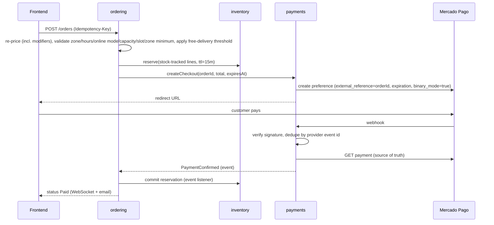
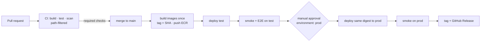

# Tech Spec — Juice Bar Omnichannel Platform (Release 1)

| Field | Value |
|-------|-------|
| Status | Draft v2 |
| Owner | Jhan Antezana |
| Last updated | 2026-09-17 |
| Implements | [PRD.md](./PRD.md) |

This document defines **how** the PRD is built: architecture, data, APIs, security, infrastructure, and delivery. Requirement IDs (`FR-*`, `NFR-*`, `BR-*`) refer to the PRD.

## 1. Decisions at a glance

| Area | Decision |
|------|----------|
| Architecture | **Modular monolith** — one Spring Boot deployable, modules enforced by Spring Modulith, one PostgreSQL schema per module |
| Backend | Java 25 (LTS) · Spring Boot 4.1.x · Spring Modulith 2.1.x · Spring Security 7 · JPA + Flyway |
| Frontend | Angular **22** (upgrade from the scaffolded 20 at M0) · zoneless · signals · hybrid SSR |
| Database | PostgreSQL 17 on Amazon RDS, one instance per environment |
| Real-time | STOMP over WebSocket; cross-instance fan-out with PostgreSQL `LISTEN/NOTIFY` |
| Payments | `PaymentGateway` port; **Mercado Pago Checkout Pro** in binary mode as first adapter |
| Preparation board | Projection owned by `preparation`; its row state arbitrates staff/customer races |
| Hosting | AWS **ECS Express Mode** (Fargate + ALB) · RDS · S3 · ECR · SES · SSM Parameter Store |
| IaC | Terraform (foundation resources); services deployed by the pipeline |
| Environments | `test` and `prod` |
| Branching | Trunk-based: short-lived branches → PR → `main`; build once, promote the same image |
| CI/CD | GitHub Actions, OIDC to AWS, reusable workflows, manual approval for `prod` |

Rejected alternatives and reasons are in §13.

## 2. Architecture overview


| Hostname | Target |
|----------|--------|
| `<domain>` / `test.<domain>` | frontend service |
| `api.<domain>` / `api.test.<domain>` | backend service (REST `/api/v1/**`, WebSocket `/ws`, webhooks `/api/v1/payments/webhooks/**`) |

Frontend and API are on different hosts of the **same site**, so the refresh cookie works with `SameSite=Strict` and CORS allows only the matching frontend origin.

## 3. Technology stack and versions

| Layer | Choice | Version policy |
|-------|--------|----------------|
| Runtime | Java 25 (Eclipse Temurin) | LTS; virtual threads enabled (`spring.threads.virtual.enabled=true`) |
| Framework | Spring Boot 4.1.x (already in `pom.xml`) | Follow patch releases via Dependabot |
| Modularity | `spring-modulith-starter-core`, `-starter-jdbc`, `-starter-test` 2.1.x | Version from `spring-modulith-bom` |
| Persistence | Spring Data JPA (Hibernate 7) · `spring-boot-starter-flyway` · PostgreSQL driver | — |
| API docs | springdoc-openapi 3.x (Boot 4 line) | — |
| Cache | `spring-boot-starter-cache` + Caffeine | In-process only |
| HTTP client | `RestClient` / HTTP interface clients | Timeouts mandatory |
| Resilience | Spring Framework 7 `@Retryable` / `@ConcurrencyLimit` (`@EnableResilientMethods`) | No extra library |
| Rate limiting | Bucket4j (in-memory, per task) | Coarse throttling of auth and checkout endpoints only; per-task counts are an accepted approximation. Security-relevant counters (lockout, idempotency) live in PostgreSQL |
| Observability | Actuator · Micrometer · `micrometer-registry-cloudwatch2` · structured JSON logs | — |
| Frontend | Angular 22 · TypeScript (per Angular 22 support matrix) · Node 22 LTS | Upgrade 20 → 21 → 22 with `ng update`, one major at a time |
| Frontend tests | Vitest (Angular default since v21) · Playwright for E2E | Migrate with `ng g @schematics/angular:refactor-jasmine-vitest` |
| Local dev | Docker Compose (`compose.yaml`) + `spring-boot-docker-compose` | — |

> **Why upgrade Angular now:** Angular 20 LTS ends 2026-11-28. Starting features on it means a forced migration mid-project. Upgrading an almost empty scaffold costs minutes; upgrading a finished app costs days.

`spring-boot-devtools` stays `optional`/`runtime` and is excluded from the production image (the Spring Boot Maven plugin already excludes it from repackaged jars).

**Scaffold changes at M0** (the current scaffold does not have them yet):

| Where | Change |
|-------|--------|
| `backend/pom.xml` | Add `spring-modulith-bom` (import) and `spring-modulith-starter-core`, `-starter-jdbc`, `-starter-test`; `spring-boot-starter-flyway`, `-actuator`, `-validation`, `-cache` + `caffeine`; `springdoc-openapi-starter-webmvc-ui`; `bucket4j-core`; `spring-boot-docker-compose` (dev only); Testcontainers PostgreSQL and WireMock (test) |
| `application.properties` | Remove `spring.profiles.active=dev`. No profile is hardcoded: `SPRING_PROFILES_ACTIVE` is `test` or `prod` in each ECS service, and `local` for development |
| `frontend/` | `ng update` 20 → 21 → 22; migrate Karma/Jasmine to Vitest; replace `RenderMode.Prerender` on `**` (§6.1); `withEventReplay()` → `withIncrementalHydration()`; add angular-eslint |

## 4. Backend design

### 4.1 Modules

Base package: `com.jhanantezana.jugueria`. Each direct sub-package is a Spring Modulith application module.

| Module | Owns | Publishes events | PRD |
|--------|------|------------------|-----|
| `identity` | Users, roles, credentials, refresh tokens, email verification | `UserCreated`, `UserDeactivated`, `UserRoleChanged` | FR-ONL-01, FR-ADM-01 |
| `store` | Store settings: hours, timezone, currency, zones (fee, delivery minutes, minimum, free threshold), online mode (open / busy / paused), estimate parameters, thresholds, reason lists | `StoreSettingsChanged`, `OnlineModeChanged` | FR-ADM-02, FR-ONL-08/12/18, FR-INS-14 |
| `catalog` | Categories, stations, products, modifier groups/options, allergens, prices, availability, images | `ProductChanged`, `AvailabilityChanged` | FR-CAT-* |
| `inventory` | Stock levels, reservations, stock movement ledger, returns | `StockAdjusted`, `StockDepleted`, `StockLow` | FR-STK-*, BR-10 |
| `ordering` | Online orders, lines (price snapshots), estimates, run-out preference, scheduling slots, status history, delivery failure/retry, cancellations | `OrderPlaced`, `OrderPaid`, `OrderStatusChanged`, `OrderCancelled`, `OrderLinesRemoved` | FR-ONL-*, BR-08/09 |
| `instore` | Tables, tickets and lines, voids, comps, transfers/merges, quick sales, in-store payments, register shifts, cash movements | `TicketLinesSent`, `TicketLineVoided`, `TicketLineComped`, `TicketTransferred`, `TicketsMerged`, `PaymentRecorded`, `PaymentVoided`, `SaleRecorded`, `SaleVoided`, `CashMovementRecorded`, `ShiftOpened`, `ShiftClosed` | FR-INS-*, FR-REG-* |
| `preparation` | Board projection (both channels): line states, markers, all-day aggregation, fire time, timestamps, run-out flags | `PreparationStarted`, `LineReady`, `OrderReady`, `OrderHandedOver`, `LineFlaggedUnavailable` | FR-PRP-*, BR-08 |
| `payments` | `PaymentGateway` port, Mercado Pago adapter, payments, webhooks, full and partial refunds | `PaymentConfirmed`, `PaymentFailed`, `RefundCompleted` | FR-ONL-05/09/15, BR-02/05 |
| `notifications` | Email (SES), real-time push (STOMP), `LISTEN/NOTIFY` bridge | — | FR-ONL-06, FR-REG-06, NFR-04 |
| `reporting` | Sales and exception read models, dashboard, heatmap, reports, CSV export | — | FR-RPT-* |
| `audit` | Append-only audit log and search | — | FR-AUD-* |
| `shared` | `Money`, `Currency`, error model, `CurrentActor`, ID generation, idempotency store (§5) | — | — |

Module rules (verified in CI by `ApplicationModules.of(JugueriaApplication.class).verify()`):

1. A module exposes only its **top-level package** (API types, commands, events). Sub-packages (`internal`, `web`, `persistence`) are private.
2. Synchronous calls between modules go through the other module's public API types — never its repositories or entities.
3. State changes that other modules react to are communicated via **domain events** (`@ApplicationModuleListener`), persisted in the Modulith **event publication registry** (transactional outbox on PostgreSQL, `spring-modulith-starter-jdbc`). Incomplete publications are retried on restart.
4. No cyclic dependencies between modules.
5. Each module owns its PostgreSQL schema; cross-schema foreign keys are not allowed (references are by ID).

Rules 3 and 5 are what make extracting a module (e.g., `payments` or `notifications` for the course's microservices project) a mechanical change instead of a rewrite.

**Deliberate exception:** a few commands need an atomic decision across two modules and call the other module's API **synchronously inside the same transaction** (same database): voiding a line or cancelling an order checks the board state (§4.3). These calls are listed in each module's API and would become a saga if the module is ever extracted.

### 4.2 Internal structure of a module

Layered inside the module; ports-and-adapters **only where an external system exists** (payments, email, storage):

```
catalog/
├── CatalogApi.java            ← public: queries/commands other modules may call
├── ProductChanged.java        ← public: event
├── internal/                  ← domain entities, services, repositories
└── web/                       ← REST controllers, request/response DTOs
payments/
├── PaymentsApi.java
├── PaymentConfirmed.java
├── internal/
│   ├── PaymentGateway.java    ← port
│   └── mercadopago/           ← adapter (only place that knows Mercado Pago)
└── web/                       ← checkout + webhook endpoints
```

### 4.3 Key flows

#### Online checkout and payment (FR-ONL-04/05/18, FR-STK-03/04, BR-02)



Rules:

- The webhook body is never trusted: the adapter verifies the provider signature, then **reads the payment from the provider API** before acting.
- Webhook processing is idempotent (`payments.webhook_event.provider_event_id` unique; state transitions guarded by `@Version`).
- **Binary mode** (`binary_mode=true`) makes the provider return only approved or rejected — no `pending`/`in_process` payments (BR-02). Trade-off accepted: slightly lower approval rate; methods that require later action are not offered.
- A reconciliation job queries the provider for checkouts without a final result after 10 minutes, covering lost webhooks.
- The preference expiration equals the reservation expiry, so the provider rejects late payments. If a late approval still arrives for an `EXPIRED` order, the system re-reserves stock; if not possible, it refunds automatically (BR-05a), audits it with actor `SYSTEM`, and notifies the customer.
- Paid orders are accepted automatically (BR-09): `OrderPaid` creates the board order; scheduled orders get `fire_at` (§4.3 "Scheduling").

#### Stock without overselling (FR-STK-04, G3)

Stock rows are updated with **conditional atomic statements** inside the business transaction, locking products in ascending `product_id` order to avoid deadlocks:

```sql
-- reserve (online checkout)
UPDATE inventory.stock_item
   SET reserved = reserved + :qty, version = version + 1
 WHERE product_id = :id AND on_hand - reserved >= :qty;   -- 0 rows ⇒ insufficient stock

-- in-store sale (cannot consume units reserved online)
UPDATE inventory.stock_item
   SET on_hand = on_hand - :qty, version = version + 1
 WHERE product_id = :id AND on_hand - reserved >= :qty;
```

Every change also inserts a row in `inventory.stock_movement` (append-only ledger with reason and reference), so `on_hand` is always explainable.

Returns (BR-10): `inventory` listens to `SaleVoided` and `RefundCompleted` and adds units back with a `stock_movement` row, unless the line is marked as waste. `TicketLineVoided` never returns stock: ticket stock is deducted only at ticket close (see "In-store tickets"), so a line voided before close was never deducted.

#### Item runs out after payment (BR-08)

Prepared products have no stock rows, so running out is handled on the board: staff flags the line (`LineFlaggedUnavailable`). A flagged line blocks its order from Ready until resolved. Online resolution follows `online_order.run_out_preference`:

| Preference | Resolution | Money |
|------------|------------|-------|
| `REPLACE` | Staff picks a product whose snapshot price (incl. modifiers) equals the original; the backend rejects any other price | None |
| `REFUND` | CASHIER/ADMIN confirms removal → `payments.refundLines(orderId, lineIds)`; amount computed from the line snapshots, never typed | Partial refund (BR-05c) |
| `CONTACT` | Board shows the customer's phone and a 5-minute countdown; afterwards the line becomes eligible for `REFUND` resolution | As chosen |

If all lines are removed, `ordering` cancels the order and `payments` refunds the remaining amount, including the delivery fee. In-store flagged lines are substituted or voided through the ticket (FR-INS-07).

#### Board state as the arbiter

`preparation.board_order.status` (`WAITING → PREPARING → READY → HANDED_OVER`, plus `CANCELLED`) decides races between channels and staff. Every transition is a conditional update on that row:

| Command | Condition | Losing side gets |
|---------|-----------|------------------|
| Start (staff) | `status = 'WAITING'` | "Order was cancelled" |
| Customer cancel (FR-ONL-15) | `status = 'WAITING'` → `CANCELLED`, then full refund | "Preparation already started" |
| Void line by SERVER (FR-INS-07) | `board_line.state = 'PENDING'` | "Line is already Ready — ask a cashier" |
| Void line by CASHIER/ADMIN | `state IN ('PENDING','READY')`; `READY` ⇒ `waste = true` | — |
| Comp line by CASHIER/ADMIN (FR-INS-08) | `state IN ('PENDING','READY')` → `COMPED`, `waste = true` | — |
| Void or comp a line covered by a recorded payment | Rejected by `instore` before touching the board | "Line already paid — void the payment first" |

The `instore`/`ordering` command and the board update run in the **same transaction** (the exception noted in §4.1), so a line can never be voided in one module and kept in the other. `ordering` mirrors board transitions into the online order status via events: `PREPARING` → Preparing, `READY` → Ready, `HANDED_OVER` → Out for delivery (delivery) or Picked up (pickup) (FR-PRP-04, FR-ONL-14). Delivered and Delivery failed are set on the online order itself, after the board.

#### In-store tickets

- One open ticket per table: partial unique index `ticket(table_id) WHERE status = 'OPEN'`. **Transfer** updates `table_id`; the index rejects an occupied target. **Merge** (S) moves lines from ticket B into A and closes B as `MERGED`; allowed only if B has no payments. Both update the board in the same transaction (§4.1 exception): transfer changes `board_order.label`; merge moves B's `board_line` rows to A's `board_order`, marks B's card `CANCELLED`, and adds a MODIFIED marker to A.
- Line states: `UNSENT → SENT → (VOIDED | COMPED)`; `UNSENT` lines can be deleted (they never reached the board). Sending publishes `TicketLinesSent`; `preparation` creates `board_line` rows.
- Payments: `in_store_payment` rows reference the ticket and optionally the paid `line_ids` (split by items). A payment on an open ticket is reversed with a `payment_void` row (reason, actor) — payments are never updated — which frees its lines for void/comp. Stock is deducted only when the ticket closes, so payment voids never touch stock. Split evenly: `n − 1` equal parts rounded down to cents, the last part takes the remainder. The ticket closes when payments cover the total; a closed ticket rejects any command except sale void.
- Quick sale: one command creates a `COUNTER` ticket, sends its lines, and records the payment.
- Repeat (S): copies product and modifier choices re-priced at current prices (a new sale, BR-03 applies to it); comp flags are never copied.

#### Register shift and blind close

- `cash_movement` rows (`IN`/`OUT`, amount, `reason_id`, reference) belong to the open shift.
- Expected cash = float + cash payments − change + cash in − cash out − voided cash sales.
- While a shift is open, the API never returns expected cash to CASHIER. `POST /shifts/{id}/close` takes the counted cash; the response returns expected cash and difference. If the difference exceeds the threshold and no note is sent, the API answers `409` with the difference, and the cashier resubmits with a note (the counted value cannot change after it is revealed).
- `ShiftClosed` triggers the summary email to ADMIN (FR-REG-06).

#### Online load, estimates, and scheduling

- **Online mode** (`store_settings.online_mode`: `OPEN`, `BUSY`, `PAUSED`) is checked at checkout. Auto-pause (S): checkout counts online board orders not yet Ready and rejects new orders when the count reaches the limit — no background job needed. `OnlineModeChanged` is pushed to storefronts.
- **Estimate** (FR-ONL-11), stored on the order and recalculated on each status change:

  ```
  ready_at    = start + base_prep_min + queue_min_per_order × (online orders ahead not Ready) + (BUSY ? busy_min : 0)
  delivery_at = ready_at + zone.delivery_min
  start       = now, or the scheduled time − base_prep_min for scheduled orders
  ```

  All parameters live in `store_settings`/`delivery_zone`. The metric "orders later than estimated" compares the last estimate shown at checkout with the actual timestamp.
- **Scheduling** (S): 15-minute slots for the same day. Capacity is claimed with `UPDATE ordering.slot_booking SET booked = booked + 1 WHERE slot_start = :s AND booked < capacity` (row created on first use). The reservation-expiry job decrements `booked` for orders that expire unpaid, and customer or ADMIN cancellation does the same, each in the same transaction as the order change. The board order gets `fire_at = scheduled_time − base_prep_min`; a one-minute job (`SKIP LOCKED`) makes due orders visible and marks them NEW.

#### Scheduled jobs in a multi-instance service

Reservation expiry and scheduled-order firing (every minute) and payment reconciliation (every 5 minutes) run on every task but claim work with `SELECT … FOR UPDATE SKIP LOCKED LIMIT 100`, so concurrent tasks never process the same row. No scheduler lock library is needed.

### 4.4 Real-time updates (FR-CAT-03, FR-PRP-03, NFR-04)

| Destination | Subscribers | Content |
|-------------|-------------|---------|
| `/topic/catalog` | Anyone (anonymous allowed) | Availability/price change signals |
| `/topic/store-status` | Anyone | Online mode changes (open / busy / paused) |
| `/topic/board` | `SERVER`, `CASHIER`, `ADMIN` | Board changes: new/modified/voided lines, status, markers, flags |
| `/topic/tables` | `SERVER`, `CASHIER`, `ADMIN` | Table status changes |
| `/topic/display` | `SERVER`, `CASHIER`, `ADMIN` (customer-screen device) | Preparing/Ready numbers and first names only |
| `/user/queue/orders` | The owning `CUSTOMER` | Own order status and estimate changes |

- STOMP over WebSocket at `/ws` using the simple in-memory broker (`spring-boot-starter-websocket`, already a dependency).
- **Cross-instance fan-out:** the in-memory broker only reaches clients connected to the same task. Each backend task holds one dedicated (non-pooled) connection with `LISTEN app_events`; after commit, publishers run `NOTIFY app_events, '<json>'`. Every task receives it and forwards to its local subscribers. Payloads carry only type + IDs (limit 8 KB); clients re-fetch details via REST.
- **REST is the source of truth.** Messages are signals. On (re)connect, clients re-fetch current state, so missed messages cause no inconsistency.
- Authentication: the access token is sent in the STOMP `CONNECT` frame headers and validated by a `ChannelInterceptor`; destination authorization via Spring Security messaging rules.
- Heartbeats every 20 s (ALB idle timeout is 60 s). On `UserDeactivated`, that user's sessions are closed.

### 4.5 Preparation board projection (FR-PRP-*)

| Table | Key columns |
|-------|-------------|
| `board_order` | `source` (`ONLINE`/`TICKET`/`QUICK_SALE`), `source_id`, `short_number`, `channel` (table / counter / pickup / delivery), `label` (table or first name), `status`, `fire_at`, `sent_at`, `started_at`, `ready_at`, `handed_over_at` |
| `board_line` | `board_order_id`, `product_id`, `display_name`, `modifiers_text`, `modifier_signature` (hash of sorted option IDs), `note`, `allergy`, `station_id`, `state` (`PENDING`/`READY`/`VOIDED`/`COMPED`), `waste`, `flagged_unavailable`, `resolution`, `ready_at` |
| `board_marker` | `board_order_id`, `line_id`, `kind` (`NEW`/`MODIFIED`/`VOID`), `created_at`, `acknowledged_by`, `acknowledged_at` |

- **All-day view** (FR-PRP-06): `GROUP BY product_id, modifier_signature` over `PENDING` lines of visible orders where `note IS NULL AND NOT allergy`; lines with notes or allergy are listed individually. Filterable by station.
- **Age colors** are computed in the client from `sent_at` (or `fire_at`) and the thresholds in settings; no server timers.
- **Undo** (5 s) is a client-side delay before sending the command; **recall** moves an order from `READY`/`HANDED_OVER` back to `PREPARING` within 30 minutes.
- Timestamps on `board_order`/`board_line` satisfy FR-PRP-10; they feed `reporting` for future preparation-time analytics.

### 4.6 Caching (NFR-02/03 without breaking FR-CAT-03)

| What | Where | Invalidation |
|------|-------|--------------|
| Menu (categories + products + availability) | Caffeine, per task | Evicted on every task via `NOTIFY` on `ProductChanged`/`AvailabilityChanged`; safety TTL 5 min |
| `GET /api/v1/catalog/menu` response | Browser/SSR | `ETag` + `Cache-Control: no-cache` (cheap `304` revalidation) |
| Product images | CloudFront in front of S3, long `Cache-Control`, content-hashed keys | New key on change |

Checkout **never** reads from cache: prices, availability, and stock are re-read from the database (FR-ONL-04).

### 4.7 Auditing (FR-AUD-*, NFR-08)

- `audit.audit_log` columns: `id`, `occurred_at`, `actor_id`, `actor_role`, `action`, `entity_type`, `entity_id`, `before` (jsonb), `after` (jsonb), `reason`, `correlation_id`, `client_ip`, `user_agent`.
- System-initiated changes (order expiry, late-payment `Expired → Paid`, automatic refunds of BR-05a/b, scheduled-order firing) use `actor_id = null` and `actor_role = 'SYSTEM'`, a reserved value valid only in `audit_log`, never assignable to users.
- Written **in the same transaction** as the business change, so no change can commit without its audit record. The `audit` module consumes domain events with a plain synchronous `@EventListener`, which runs inside the publisher's transaction (an audit failure rolls back the change). This is deliberately different from cross-module reactions, which use `@ApplicationModuleListener` (asynchronous, after commit, via the outbox). Both can consume the same event.
- Coverage rule: **every command that changes an entity listed in FR-AUD-01 publishes a domain event**, even if no other module consumes it (the event list in §4.1 names the main ones, not all). Module tests assert the event is published for each such command, which is what backs the "100%" in NFR-08.
- Append-only (FR-AUD-02, BR-04) is enforced by the database, not by convention: the application role has `INSERT, SELECT` on `audit.audit_log` and no `UPDATE/DELETE`. The same applies to `inventory.stock_movement`, `ordering.order_status_history`, `instore.in_store_payment`, and `instore.cash_movement`.
- Every request gets a `correlation_id` (from `X-Request-Id` or generated) propagated to logs, audit rows, and events.

### 4.8 Data model (main tables)

IDs are UUID v7 (time-ordered, generated in the application). Money is `numeric(12,2)` + ISO-4217 currency, mapped to a `Money` value object. Prices are tax-inclusive and the currency is a single store setting, so no tax fields are modeled in Release 1 (BR-01). Timestamps are `timestamptz` in UTC (BR-06). Mutable aggregates have a `version` column for optimistic locking.

| Schema | Tables |
|--------|--------|
| `identity` | `user_account` (incl. `failed_attempts`, `locked_until`), `refresh_token` (hashed, family for rotation), `verification_token` |
| `store` | `store_settings` (incl. `online_mode`, estimate parameters, thresholds, capacity limit), `opening_hours`, `delivery_zone` (fee, delivery minutes, minimum, free threshold), `reason` (type: void / comp / cash out / stock adjustment) |
| `catalog` | `station`, `category` (`station_id`), `product` (incl. `quick_sale_pinned`), `modifier_group` (required, min, max), `modifier_option` (price delta, available), `product_modifier_group`, `allergen`, `product_allergen`, `option_allergen` |
| `inventory` | `stock_item`, `stock_reservation`, `stock_movement` |
| `ordering` | `online_order` (incl. `run_out_preference`, `scheduled_for`, `estimated_ready_at`, `estimated_delivery_at`, notes), `online_order_line` (product + modifier snapshot, note, allergy), `order_status_history`, `slot_booking`, `daily_order_counter` |
| `instore` | `dining_table`, `ticket` (table or counter name, `bill_requested`), `ticket_line` (snapshot, note, allergy, state, reason, waste), `register_shift`, `cash_movement`, `in_store_payment` (+ `line_ids`), `payment_void`, `sale_void` |
| `preparation` | `board_order`, `board_line`, `board_marker` (§4.5) |
| `payments` | `payment`, `webhook_event`, `refund` (amount + refunded line IDs) |
| `shared` | `idempotency_key` |
| `reporting` | `sales_line` (date, hour, weekday in store timezone, channel, product, category, modifiers, qty, amounts, refund/comp/waste flags, employee), `exception_event` (type, employee, reason, amount), `shift_summary` — all fed by events |
| `audit` | `audit_log` (partitioned by year) |
| `modulith` | `event_publication` |

Short order numbers (`W-042`, `L-017`) come from `daily_order_counter`, reset per business day in the store timezone.

Line snapshots store product name, chosen options with their price deltas, and the line total, so reports, refunds, and substitutions never depend on the current catalog (BR-03).

### 4.9 Dashboard and reports (FR-RPT-*)

- Read models are updated by `@ApplicationModuleListener`s (after commit); a report can lag a few seconds, which is acceptable.
- **Today dashboard**: sums over `sales_line` for today up to the current time vs the same weekday last week up to the same time; open orders, open shifts, 86 list, and low stock come from the owning modules' APIs. The page refreshes every 60 s (no WebSocket needed).
- **Heatmap**: `GROUP BY weekday, hour` in the store timezone.
- **Exceptions**: `exception_event` grouped by employee and reason; employees above `store_settings.exception_threshold` in the range are flagged.
- CSV export streams the same queries.

### 4.10 Database migrations

- Flyway runs at application startup (PostgreSQL advisory lock makes it safe with several tasks).
- Versions are timestamps to avoid collisions between modules: `V2026_09_17_1030__catalog_create_product.sql`, under `db/migration/<module>/`.
- Flyway connects as the `migrator` role (DDL); the application as `app` (DML only). Credentials come from SSM.
- **Expand/contract only**: a release may add columns/tables; removing or renaming happens in a later release, after no deployed version uses them. This is what makes image rollback (§10.5) safe.

## 5. API design

| Topic | Convention |
|-------|------------|
| Style | REST + JSON, resources under `/api/v1/**` |
| Versioning | Literal `/api/v1` prefix in controller mappings. Spring Framework 7 API versioning is adopted only when a `v2` is needed (spike first: path-segment strategy has open issues, e.g. spring-framework#35404) |
| Errors | RFC 9457 Problem Details (`spring.mvc.problemdetails.enabled=true`) with a stable `code` field |
| Money | `{ "amount": "12.50", "currency": "PEN" }` — amount as string, never a float |
| Time | ISO-8601 UTC |
| Pagination | `?page=&size=` (max 100), response includes `totalElements` |
| Idempotency | `Idempotency-Key` header required on every command that moves money or stock: `POST /orders`, order cancel, ticket payments, quick sales, line void/comp, cash movements, shift close, refunds. Stored in PostgreSQL `shared.idempotency_key` (`key` unique, `request_hash`, `response`, `expires_at` = 24 h), inserted **in the same transaction** as the operation — never in memory, because retries can reach a different task. Same key + different body ⇒ `422` |
| Concurrency | `ETag`/`If-Match` on updates of catalog items and settings |
| Contract | OpenAPI generated by springdoc, committed as `backend/api/openapi.json`; CI fails if the generated spec differs (API changes are always explicit in PRs). The frontend client is generated from it |

Main resources:

| Area | Resources |
|------|-----------|
| Public / customer | `/auth/*`, `/me`, `/catalog/menu`, `/store/status`, `/orders`, `/orders/{id}/cancel` |
| In-store | `/tables`, `/tickets`, `/tickets/{id}/lines`, `/tickets/{id}/send`, `/tickets/{id}/transfer`, `/tickets/{id}/merge`, `/tickets/{id}/lines/{lineId}/void`, `…/comp`, `/tickets/{id}/payments`, `/quick-sales`, `/sales/{id}/void` |
| Register | `/shifts`, `/shifts/{id}/cash-movements`, `/shifts/{id}/close` |
| Board | `/board` (views: `tickets`, `all-day`, `ready`; `?station=`), `/board/orders/{id}/start|ready|recall|handover`, `/board/lines/{id}/ready|flag|resolve`, `/board/markers/{id}/ack`, `/store/online-mode` |
| Admin | `/admin/products`, `/admin/modifier-groups`, `/admin/allergens`, `/admin/stations`, `/admin/tables`, `/admin/reasons`, `/admin/stock`, `/admin/users`, `/admin/settings`, `/admin/orders/{id}/refunds` |
| Reports | `/reports/dashboard`, `/reports/heatmap`, `/reports/sales`, `/reports/shifts`, `/reports/exceptions`, `/audit` |
| Integration | `/payments/webhooks/mercadopago` |

## 6. Frontend design

### 6.1 Rendering strategy (hybrid, per route)

The scaffold prerenders `**`; that must change — the menu depends on live data.

| Route area | Render mode | Reason |
|------------|-------------|--------|
| `/` landing, `/legal/*` | `Prerender` | Static, best LCP |
| `/menu`, `/menu/:category` | `Server` | SEO + fresh prices/availability; incremental hydration with `@defer` |
| `/cart`, `/checkout`, `/account/**`, `/orders/**` | `Client` | User-specific, no SEO |
| `/staff/**` (tables, tickets, board, register), `/display`, `/admin/**` | `Client` | Authenticated tools, no SEO |

`provideClientHydration(withIncrementalHydration())` replaces `withEventReplay()` (event replay is included).

### 6.2 Structure (screaming architecture, lazy per feature)

```
src/app/
├── core/        auth (token store, interceptors, guards), api (generated client), realtime (STOMP), error handling
├── shared/ui/   presentational components (no services injected)
└── features/
    ├── storefront/   menu, product detail
    ├── cart/ checkout/ account/ orders/
    ├── staff/        tables, tickets, quick-sale, board, register-shift
    ├── display/      customer-facing Preparing/Ready screen
    └── admin/        dashboard, catalog (modifiers, allergens, stations), tables, reasons, stock, users, settings, reports, audit
```

- Container/presentational split: route components orchestrate; `shared/ui` components receive `input()` and emit `output()`.
- State: signals in feature-scoped services (provided in the feature route's `providers`), `computed()` for derivations. No global store library. This deliberately narrows the `providedIn: 'root'` default of `frontend/.claude/CLAUDE.md`: only cross-feature services (auth, API client, realtime) are root singletons, so feature state such as cart or board filters does not leak between features.
- Accessibility (NFR-10): semantic HTML, labelled controls, focus management in dialogs, and color tokens meeting WCAG AA contrast; board age colors are always paired with text (elapsed minutes), never color alone.
- Forms: Reactive Forms; adopt Signal Forms only once it is stable.
- Role guards per feature (`canMatch`), mirrored by backend authorization (the backend is the only real enforcement).
- Cart persisted in `localStorage` (FR-ONL-02); prices shown from the server, recalculated at checkout.
- UI text in Spanish via Angular i18n extraction (NFR-12).
- Product configurator (storefront and ticket editor) is one shared component driven by the modifier-group rules (required, min/max), so both channels validate identically; the backend validates again.

### 6.3 Board and staff screens

| Concern | Decision |
|---------|----------|
| Sound (FR-PRP-07) | Browsers block audio until a user gesture: the board starts with an "Enable sound" tap, and shows a warning while sound is off. Distinct sounds for NEW, MODIFIED, VOID |
| Screen always on | Screen Wake Lock API on board and display routes, re-acquired on visibility change |
| Disconnected (FR-PRP-03) | STOMP disconnect ⇒ full-width banner, action buttons disabled; on reconnect the view re-fetches state before enabling actions |
| Undo (FR-PRP-04) | The command is sent after a 5 s undo window; closing the page sends pending commands immediately |
| Layout | Board and display designed for 1080p landscape, readable at 2 m (NFR-11); ticket editor and table grid for 10" tablets |

### 6.4 Auth in the browser

- Access token (JWT, 15 min) kept **in memory only**.
- Refresh token in a `__Host-` cookie: `HttpOnly; Secure; SameSite=Strict`, rotated on every use; reuse of a rotated token revokes the whole family.
- On load, the app calls `POST /auth/refresh` (with `credentials: 'include'`) to restore the session. SSR never renders authenticated content, so tokens never exist on the SSR server.
- Why this cookie works cross-origin: `SameSite` is evaluated per **site** (registrable domain), and `<domain>` and `api.<domain>` are the same site, so the cookie is sent; `__Host-` pins it to `api.<domain>` exactly. Do **not** add a `Domain` attribute or relax `SameSite` — both would weaken it.

## 7. Security

| Concern | Control |
|---------|---------|
| Authentication | Email + password (delegating encoder, bcrypt default); email verification; account lockout after 5 failed attempts for 15 min, stored in `identity.user_account` so it holds across all tasks; Bucket4j throttling on `/auth/*` as a secondary layer |
| Tokens | JWT signed with RS256 (key pair in SSM, `kid` for rotation). Asymmetric so a future extracted service validates tokens without sharing a secret |
| Session revocation | Deactivation/role change revokes refresh tokens; access tokens expire ≤ 15 min (FR-ADM-01); WebSocket sessions closed |
| Authorization | Role-based (`CUSTOMER`, `SERVER`, `CASHIER`, `ADMIN`) with method security; ownership checks for customer data; matrix = PRD §4 |
| First admin | Created by a one-off bootstrap command using credentials from SSM; no default accounts in code |
| Payments | Checkout Pro redirect ⇒ card data never reaches our systems (NFR-09); webhook signature verification + server-side fetch |
| Secrets | SSM Parameter Store `SecureString` under `/jugueria/<env>/…`; the task role of each environment reads only its own path; nothing in the repo or images |
| Data | RDS encrypted at rest (KMS), TLS enforced (`rds.force_ssl=1`); DB not publicly accessible; S3 bucket fully private, readable only by CloudFront (Origin Access Control); uploads only by the backend task role |
| Web | CORS allowlist = frontend origin; security headers (HSTS, CSP, `X-Content-Type-Options`, `frame-ancestors 'none'`) set by the SSR server and backend |
| Input | Bean Validation on every DTO; no dynamic SQL; output encoding by Angular |
| Personal data | BR-07: deletion anonymizes customer data; logs never contain passwords, tokens, or full addresses |

## 8. Infrastructure (AWS)

### 8.1 Components per environment

| Component | `test` | `prod` |
|-----------|--------|--------|
| Region | `us-east-1` | `us-east-1` |
| ECS Express service `backend` | 0.5 vCPU / 1 GB, 1 task | 0.5 vCPU / 1 GB, min 1 · max 4 tasks (CPU 60% target) |
| ECS Express service `frontend` | 0.25 vCPU / 0.5 GB, 1 task | 0.25 vCPU / 0.5 GB, min 1 · max 3 tasks |
| ALB | Provisioned by Express Mode (HTTPS via ACM, HTTP→HTTPS redirect) | same |
| RDS PostgreSQL 17 | `db.t4g.micro`, single-AZ, 20 GB gp3, backups 1 day | `db.t4g.micro`, single-AZ, 20 GB gp3, backups 14 days + PITR, deletion protection |
| S3 + CloudFront (media) | `jugueria-test-media` | `jugueria-prod-media` (versioning on) |
| SES | Sandbox (verified addresses only) | Production access |
| Logs retention | 14 days | 90 days |

Shared: ECR repositories `jugueria/backend`, `jugueria/frontend` (immutable tags, scan on push, lifecycle keeps last 30 images); Route 53 hosted zone; GitHub OIDC provider and IAM roles.

`test` runs only during working hours: `scheduled-test-scale.yml` sets both services to 0 tasks overnight (23:00–07:00 store time) and back to 1 in the morning; `cd.yml` scales `test` to 1 before deploying if it is at 0 (PRD C2).

**Scaling without code changes (NFR-06):** capacity grows by changing ECS min/max tasks or task size and the RDS instance class — all configuration in the pipeline or Terraform.

**Why these sizes are enough:** NFR-05 (10× peak ≈ 300 orders/hour, 1,000 concurrent shoppers) is dominated by cached menu reads. A 0.5 vCPU Spring Boot task with virtual threads serves hundreds of requests/second of cached reads; the database sees mostly checkout writes. Load test at M4 confirms or adjusts.

**Connection budget:** Hikari pool 10 + 1 `LISTEN` connection per task → max 44 connections at 4 tasks, within `db.t4g.micro` limits.

### 8.2 Networking (no NAT gateway)

- Default-style VPC with public subnets in 2 AZs for ALB and tasks; tasks have public IPs for egress (Mercado Pago, SES), but their security group only accepts traffic from the ALB.
- RDS in private subnets; security group accepts `5432` only from the backend task security group.
- A NAT gateway (~USD 33/month + data) is intentionally avoided; revisit if compliance requires private tasks.

### 8.3 Cost estimate — budget for NFR-13 (validate with AWS Pricing Calculator at M0)

| Item | test | prod |
|------|------|------|
| Fargate (backend + frontend) | ~18 (16 h/day) | ~27 (always on) |
| ALB | ~18 | ~18 |
| RDS `db.t4g.micro` + storage | ~15 | ~16 |
| CloudWatch, ECR, Route 53, SES, SSM, CloudFront (free-tier volume) | ~5 | ~6 |
| **Total (USD/month)** | **~56** | **~67** |

**Budget (NFR-13): ≤ USD 130/month for `test` + `prod`**, tracked with an AWS Budgets alert at 80%. Further levers: stop the `test` RDS instance outside working hours; RDS free tier during the first 12 months; Fargate Graviton (ARM64) once Express Mode support is confirmed.

### 8.4 Infrastructure as Code

- `infra/` holds Terraform (S3 backend with native state locking) for: ECR, RDS, security groups, S3, SES identities, SSM parameters (placeholders, values set out of band), Route 53/ACM, GitHub OIDC provider, IAM roles (per environment, least privilege).
- The **ECS Express services** are created/updated by the deploy pipeline (`aws-actions/amazon-ecs-deploy-express-service`), not by Terraform, to avoid two tools owning the same resource.
- `infra/envs/test` and `infra/envs/prod` share modules; `terraform plan` runs on PRs touching `infra/**`; `apply` runs manually through the protected environment.

## 9. Repository, branching, and release

### 9.1 Repository layout (monorepo)

```
store-project/
├── .github/
│   ├── workflows/        ci-backend.yml, ci-frontend.yml, ci-infra.yml, cd.yml, rollback.yml, scheduled-test-scale.yml
│   ├── actions/          composite actions (setup-java-maven, setup-node-cache, aws-login)
│   ├── CODEOWNERS · dependabot.yml · pull_request_template.md
├── backend/              Spring Boot (Dockerfile, api/openapi.json)
├── frontend/             Angular (Dockerfile)
├── e2e/                  Playwright tests
├── infra/                Terraform
├── docs/                 PRD.md, tech-spec.md, runbooks/
└── compose.yaml          local PostgreSQL + Mailpit
```

`store-project` is already initialized as its own Git repository (no commits yet); M0 pushes it to GitHub and applies the rules below.

### 9.2 Branching (trunk-based)

| Rule | Setting |
|------|---------|
| Trunk | `main` — always deployable |
| Work branches | `feat/*`, `fix/*`, `chore/*`, `docs/*`, `refactor/*` — branched from `main`, merged within ~2 days |
| Merge | Pull request only; **squash merge**; PR title in Conventional Commits (validated in CI) |
| Protection (ruleset on `main`) | Required checks green, branch up to date, linear history, no force-push, no deletion, conversations resolved |
| Hotfix | Same flow (`fix/*` → PR → `main`) — the pipeline is fast enough; no long-lived release or develop branches |
| Unfinished work | Hidden behind configuration flags in `store_settings`, never behind long-lived branches |

### 9.3 Versioning and traceability (NFR-08)

- Every merge to `main` builds **one** image per changed app, tagged with the full commit SHA (ECR tags immutable).
- Promotion to `prod` deploys that **same digest** — never rebuilds.
- A successful `prod` deploy creates a Git tag `vYYYY.MM.DD-N` and a GitHub Release with generated notes, the image digests, and the approver.
- Result: every production change links commit → PR → pipeline run → image digest → approver.

## 10. CI/CD (GitHub Actions)

### 10.1 Pipeline flow



### 10.2 Workflows

| Workflow | Trigger | Jobs |
|----------|---------|------|
| `ci-backend.yml` | PR/push touching `backend/**` | `mvn verify`: unit + integration (Testcontainers PostgreSQL, WireMock for Mercado Pago) + Modulith verification + JaCoCo gate + OpenAPI drift check; dependency review |
| `ci-frontend.yml` | PR/push touching `frontend/**` | lint (angular-eslint), Vitest with coverage gate, production build (SSR) |
| `ci-infra.yml` | PR touching `infra/**` | `terraform fmt -check`, `validate`, `plan` per environment (plan posted as PR comment) |
| `ci-common.yml` | Every PR | PR-title lint (Conventional Commits), secret scan (gitleaks), workflow lint (actionlint) |
| `cd.yml` | Push to `main` | detect changed apps → build/scan/push images → scale `test` up if at 0 → deploy `test` → smoke + Playwright E2E → approval → deploy `prod` → smoke → release |
| `rollback.yml` | `workflow_dispatch` (env, app, image SHA) | Redeploy a previous image digest; requires the same environment approval |
| `scheduled-test-scale.yml` | `schedule` (cron) | Scale `test` down at night / up in the morning |

Shared logic lives in **reusable workflows** (`_build-image.yml`, `_deploy-ecs.yml`) and **composite actions**.

### 10.3 Environments and gates

| Environment | Deployed by | Protection | Secrets/vars |
|-------------|-------------|------------|--------------|
| `test` | Automatic after merge | Only `main` can deploy | `AWS_ROLE_ARN_TEST`, service names, URLs |
| `prod` | After approval | Required reviewer (owner), only `main`, wait timer 0 | `AWS_ROLE_ARN_PROD`, service names, URLs |

Application secrets are **not** GitHub secrets: they live in SSM and are injected into tasks at runtime. GitHub only holds role ARNs and non-sensitive variables. Each ECS service sets `SPRING_PROFILES_ACTIVE` to its environment (`test` or `prod`); `application-test.properties` and `application-prod.properties` hold only non-secret differences.

### 10.4 Pipeline hardening

- OIDC to AWS (`aws-actions/configure-aws-credentials`) — no long-lived keys. Role trust restricted to `repo:<owner>/store-project:environment:<env>`.
- `permissions: contents: read` by default; `id-token: write` only in deploy jobs.
- Third-party actions pinned by commit SHA; Dependabot updates actions, Maven, npm, Docker base images.
- Image scanning with Trivy (fail on fixable CRITICAL/HIGH — the automated part of NFR-09; the OWASP Top 10 checklist is a PR-template item for `prod` releases); SBOM and build provenance attestation (`actions/attest-build-provenance`).
- `concurrency`: PR workflows cancel in-progress runs of the same branch; deploys use `group: deploy-<env>`, `cancel-in-progress: false` (deploys are serialized, never interrupted).
- Caches: Maven `~/.m2`, npm, Docker layers (`type=gha`).
- CodeQL enabled if the repository is public (free); otherwise Dependabot + Trivy + gitleaks remain mandatory.

### 10.5 Deployment and rollback

- ECS rolling deployment with `prod` minimum 1 healthy task, so deploys cause no downtime (NFR-01); the ALB health check targets `/actuator/health/readiness` (backend) and `/healthz` (frontend). A task that fails readiness never receives traffic.
- Smoke tests after each deploy hit health, menu, and auth endpoints; failure marks the run red and blocks promotion.
- Rollback = `rollback.yml` with the previous SHA (target < 30 min, PRD §9). Safe because migrations follow expand/contract (§4.10).
- Database restore (disaster, not rollback) is a documented runbook: RDS point-in-time restore to a new instance, switch the SSM endpoint, redeploy. Drill at M4 (NFR-07).

### 10.6 Course coverage

| Course module | Where it is applied |
|---------------|---------------------|
| 06 Branching strategies | §9.2 trunk-based |
| 07 Matrix builds | Playwright across Chromium/Firefox/WebKit; backend tests split by module |
| 08 / 09 CI backend / frontend | `ci-backend.yml`, `ci-frontend.yml` |
| 04 Marketplace and own actions (cache) | Official setup actions with built-in dependency cache; composite actions in `.github/actions/*` |
| 05 Secrets, variables, environments | §10.3 environment protection and variables; §7 application secrets in SSM, not in GitHub |
| 10 Testing in pipelines | §11 |
| 11 Monorepos and path filters | Path-filtered CI; changed-app detection in `cd.yml` |
| 12 Monolith vs microservices | Modular monolith with extraction-ready modules |
| 13 Docker build/push ECR | `_build-image.yml` with Docker layer cache (`type=gha`) |
| 14 Concurrency | §10.4 |
| 15 Multi-environment | `test` → `prod` with approval |
| 16 Rollback | `rollback.yml`, expand/contract |
| 17 Continuous deploy to AWS | ECS Express Mode (the course's App Runner content is replaced: App Runner closed to new customers on 2026-04-30) |
| 18 Reusable workflows / composite actions | `_build-image.yml`, `_deploy-ecs.yml`, `.github/actions/*` |
| 19 Supply-chain security / OIDC | §10.4 |
| 21 Observability and cost | §12, §8.3 budget, scheduled scale-down, cache + path filters + concurrency combined |
| 22 Debugging pipelines | Runbook `docs/runbooks/pipeline-debugging.md` |
| 23 Final project (microservices) | Future: extract `notifications` or `payments` |

Module 20 (self-hosted runners) is intentionally not used: GitHub-hosted runners cover the needs and avoid maintaining a machine.

## 11. Testing strategy

Development follows **TDD**: a failing test precedes each production change.

| Level | Tooling | Scope | Gate |
|-------|---------|-------|------|
| Unit (backend) | JUnit (Boot 4.1 managed) + AssertJ + Mockito | Domain rules: pricing and price snapshots (BR-03), estimate formula, state machines, shift reconciliation, business-day boundaries in the store timezone (BR-06) | Runs on every PR |
| Module integration | `@ApplicationModuleTest` + Testcontainers PostgreSQL (`@ServiceConnection`) | One module with its schema; published events asserted with `PublishedEvents` | Every PR |
| Architecture | `ApplicationModules.verify()` | Module boundaries and cycles | Every PR |
| Adapter | WireMock | Mercado Pago adapter: approved/rejected only (BR-02), partial refunds, timeouts, bad signature | Every PR |
| API contract | OpenAPI drift check | Backend spec vs committed spec | Every PR |
| Unit (frontend) | Vitest + Angular Testing utilities | Services, signals, components; i18n extraction runs in the build and fails on untranslated source text (NFR-12) | Every PR |
| Real-time latency | Integration test with two app instances | Change committed on instance A reaches a subscriber on instance B in ≤ 5 s (NFR-04) | Every PR |
| Race conditions | Module integration tests with parallel threads | Start vs customer cancel; SERVER void vs line Ready; transfer to an occupied table; two slots claims for the last capacity | Every PR |
| E2E | Playwright against `test` | Journeys 2–7 of PRD §7 fully (two browser contexts: staff tablet + board); journey 1 up to the payment redirect | After each `test` deploy |
| Performance | k6 against `test` | NFR-03/05 | At M4 and before major releases |
| Accessibility and devices | axe-core in Playwright; Playwright viewports (mobile, 10" tablet, 1080p board) | NFR-10 on storefront pages; NFR-11 layouts | After each `test` deploy |

Coverage gates: backend ≥ 80% lines on `internal` packages; frontend ≥ 80% lines on `core` and `features`. Payment confirmation end-to-end is covered by backend integration tests (provider stubbed) because provider sandboxes are not reliable enough for gating.

## 12. Observability and operations

| Signal | Implementation |
|--------|----------------|
| Logs | JSON (`logging.structured.format.console=ecs`) to CloudWatch; fields include `correlation_id`, `trace_id`, `user_id` (never PII) |
| Metrics | Micrometer → CloudWatch: HTTP latency/errors, JVM, Hikari pool, plus business metrics (`orders.placed`, `orders.paid`, `orders.late_vs_estimate`, `payments.failed`, `refunds.automatic`, `board.lines_voided`, `webhooks.lag`, `events.incomplete`) |
| Tracing | Micrometer tracing IDs in logs for correlation; a tracing backend is deferred until more than one service exists |
| Health | Actuator liveness/readiness; only `health` and `info` exposed |

Alarms (SNS → owner email): ALB 5xx > 2% over 5 min; p95 latency > 1 s over 10 min; unhealthy targets > 0 for 5 min; RDS CPU > 80% / free storage < 20%; `payments.failed` spike; incomplete event publications older than 10 min.

Runbooks in `docs/runbooks/`: rollback, database restore, payment webhook replay, stuck register shift, paper fallback (internet loss), pipeline debugging.

## 13. Decision record

| # | Decision | Chosen | Rejected (why) |
|---|----------|--------|----------------|
| D1 | Architecture | Modular monolith + Spring Modulith | Microservices now (operational cost before domain is proven); plain layered monolith (boundaries erode, extraction becomes a rewrite) |
| D2 | Hosting | ECS Express Mode | App Runner (closed to new customers since 2026-04-30; no WebSocket support); EC2 + Compose (manual patching, no rolling deploys, single point of failure); classic ECS + hand-made ALB/VPC (more to build for the same result); EKS (overkill) |
| D3 | Database | PostgreSQL, one RDS instance per env | Shared instance for test + prod (test load and migrations could hit prod); Aurora Serverless v2 (higher minimum cost at this scale); NoSQL (stock/payment consistency needs transactions) |
| D4 | Real-time | STOMP + `LISTEN/NOTIFY` fan-out | External broker relay (RabbitMQ/Redis: extra infrastructure); SSE (fine, but the WebSocket starter is already chosen and STOMP gives per-user destinations) |
| D5 | Cache | Caffeine + cluster-wide eviction | Redis/ElastiCache (extra cost and infra; not needed until cached data outgrows memory) |
| D6 | Payments | Port + Mercado Pago Checkout Pro (provisional until PRD Q1 confirms the country) | Stripe (weaker local payment method coverage in LatAm); Checkout API/Bricks (larger PCI scope); provider SDK in domain (lock-in) |
| D7 | Frontend version | Upgrade to Angular 22 at M0 | Stay on 20 (LTS ends 2026-11-28) |
| D8 | Branching | Trunk-based + promotion | Gitflow (long-lived branches, merge overhead, rebuilds per branch contradict "build once") |
| D9 | Environments | `test` + `prod` | Add `staging` (cost and effort not justified for one developer; `test` fulfils pre-prod role) |
| D10 | IaC | Terraform for foundation, pipeline for services | Everything by console (not auditable); everything in Terraform (conflicts with deploy action ownership) |
| D11 | Online order acceptance | Automatic on payment + busy mode / pause / capacity (BR-09) | Manual accept (needs someone watching and a timeout-refund path; marketplaces need it because they don't control the kitchen) |
| D12 | Payment approval | Mercado Pago binary mode | Pending/in-review payments (up to hours of review; useless for drinks ordered for now) |
| D13 | Board state | `preparation.board_order` row as arbiter, conditional updates | Distributed locks or status duplicated in each module (race conditions between staff and customer actions) |
| D14 | Offline | Disconnected state + paper fallback | Offline-first staff screens with local sync (large effort; deferred) |

## 14. Risks and open questions

| # | Risk / question | Mitigation / owner |
|---|-----------------|--------------------|
| R1 | ECS Express Mode is recent; some features (ARM64, deployment circuit breaker, sharing one ALB across environments) are unconfirmed | Validate in M0 walking skeleton; fall back to standard ECS with the same pipeline if blocked |
| R2 | Single-AZ RDS: an AZ outage means restore time (within NFR-07's 2 h RTO) | Accepted for Release 1; Multi-AZ when revenue justifies (~2× RDS cost) |
| R3 | Mercado Pago availability/fees depend on the country (PRD Q1) | Confirm with Q1 by M1, before payments work starts in M3; the port allows switching the adapter |
| R4 | Electronic invoicing may be legally required (PRD Q2) | If yes, add an `invoicing` module and provider before M3 |
| R5 | SES production access requires AWS approval | Request at M1 |
| R6 | Terraform AWS provider support for Express Mode resources may lag | Services owned by the deploy action (§8.4) |
| R7 | Internet loss stops in-store operation (D14) | Runbook `docs/runbooks/paper-fallback.md`: paper tickets, then record sales when back online; revisit offline mode if outages exceed 1/month |
| R8 | Estimate formula may be inaccurate at first | Parameters are settings; tune weekly with the "late vs estimate" metric |
| R9 | Scope grew with the benchmark (~30–40% on M2–M4) | "S" items move first to a follow-up release (PRD C1) |

## 15. Traceability

| PRD | Modules | Verified by |
|-----|---------|-------------|
| FR-CAT-*, BR-01/03 | `catalog`, `notifications` | Module tests (modifier min/max rules, price snapshot unaffected by later price changes); E2E journey 6 |
| FR-STK-*, BR-10 | `inventory`, `ordering`, `instore` | Concurrency test (parallel reserve/sell of the last unit); stock returned on void unless waste |
| FR-ONL-*, BR-02/09 | `identity`, `ordering`, `payments`, `store`, `notifications` | Module tests + WireMock (binary mode, partial refunds); estimate formula, zone minimum and free-delivery tests; E2E journeys 1 and 5 |
| FR-INS-*, BR-04/11/12 | `instore`, `preparation`, `inventory` | Module tests (void permissions by state, paid-line void rejected, transfer, merge, split rounding); DB-privilege test (no UPDATE/DELETE on payments and cash movements); E2E journeys 2–4 |
| FR-REG-* | `instore`, `notifications` | Blind-close test: expected cash never returned before counted cash |
| FR-PRP-*, NFR-04 | `preparation`, `notifications` | All-day aggregation tests; multi-instance fan-out latency test (≤ 5 s); E2E with two browser contexts |
| BR-05, BR-08, FR-ONL-09/13/15 | `preparation`, `ordering`, `payments` | Module tests per run-out preference and per refund exception (a/b/c); refund amount = removed line snapshots; cancel vs start race |
| Idempotency (§5) | `shared` + callers | Integration test: same key sent concurrently to two app instances creates one order |
| FR-ADM-*, FR-AUD-*, BR-07 | `identity`, `store`, `audit` | DB-privilege test (UPDATE/DELETE on audit fails); audit failure rolls back the business change; account deletion anonymizes customer data and keeps orders |
| FR-RPT-*, BR-06 | `reporting` | Read-model tests against seeded events (same-weekday comparison, heatmap and business day in store timezone, exception thresholds) |
| NFR-01/07 | Infra (§8.1, §10.5), runbooks | Zero-downtime deploy check in smoke tests; backup-restore drill at M4 |
| NFR-02/03/05/06 | Caching, sizing (§4.6, §8.1) | k6 load test with a scale-out step (tasks 1 → 2 by configuration), Lighthouse CI |
| NFR-08 | Audit, §9.3 | Release record contains commit, run, digest, approver |
| NFR-09 | §7, §10.4 | Trivy/gitleaks/Dependabot gates; OWASP checklist in the `prod` release PR |
| NFR-10/11/12 | §6 | axe-core and viewport tests; i18n extraction in the build |
| NFR-13 | §8.3 | AWS Budgets alert at 80% of USD 130/month |
